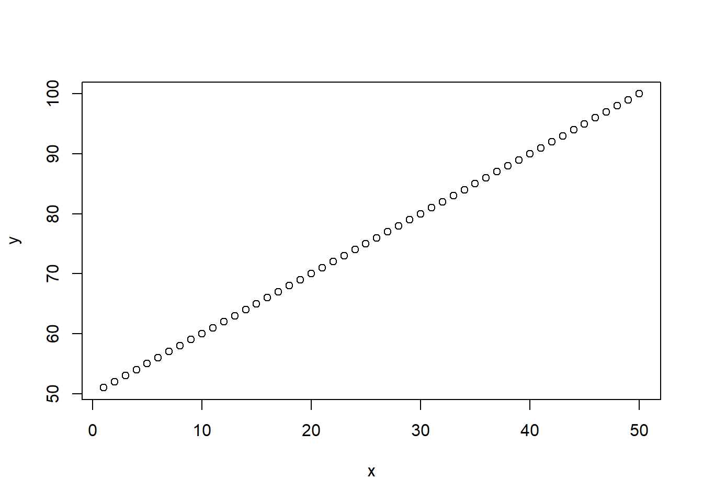
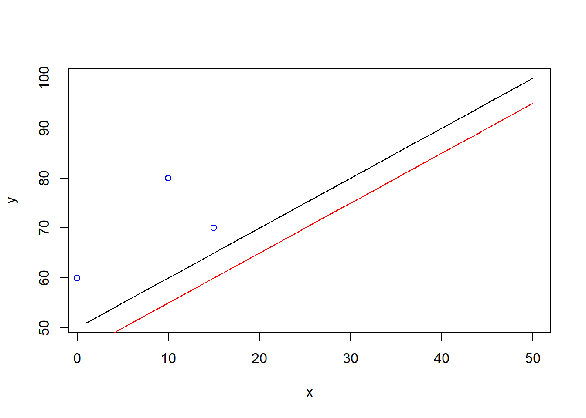
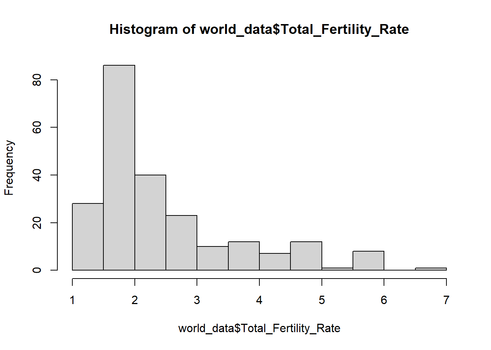
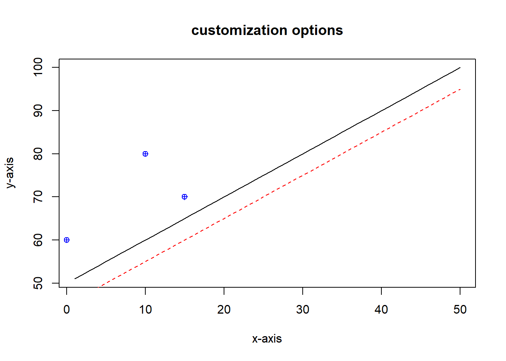
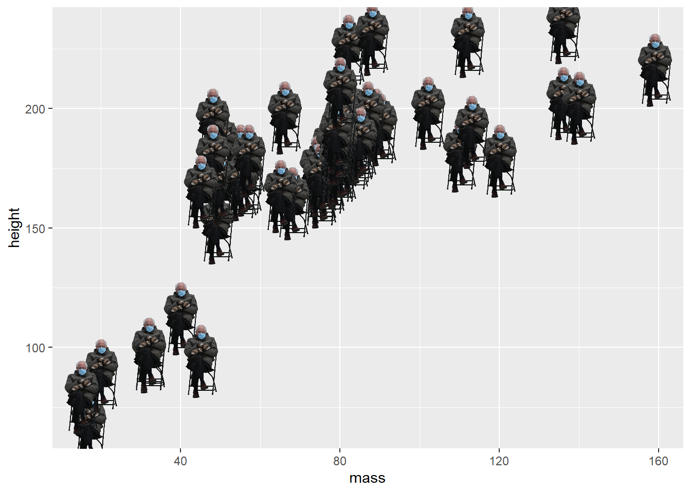

# Introduction to R


<script src="js/hideOutput.js"></script>


For modern evolutionary biologists, handling large amounts of data is a fundamental skill. Familiarity with a programming language, particularly one that makes it straightforward to visualise, explore and filter data is the best way to achieve this ability. There are many different types of programming and scripting languages; the entire concept may seem daunting at first, especially if you have never encountered it before. This is natural, many other biologists applying scripting tools on a daily basis have started from similar first principles. A little patience with the basics of any form of programming and you will soon be able to do much more than you thought possible.

For this section, we will be introducing you to R, a statistical programming language and environment that is widely used in the biological sciences. R is flexible, clear and easy to learn. It also extremely good for producing quick, high quality visualisations of data, which makes it very useful for anyone trying to explore their data. Perhaps the greatest strength of R is its focus on statistics - this makes it an excellent tool for carrying out and learning statistical analysis. R is also used for data analysis beyond evolutionary biology - it forms the basis of data science for companies such as Google, Facebook and Twitter, among many others. If you find yourself wondering why you are learning a programming language, it is worth remembering this point - familiarity with R and scripting will provide you with a very flexible and useful skill.

We believe the best way to get an idea of what R is and what it is capable of is to dive straight in. There really is no better way to learn and understand than to demonstrate the workings of the language to yourself. As a brief overview, we will show the utmost basics here before moving onto more advanced topics in the next chapter. We will also introduce some basic statistical concepts for which R makes visualisation and understanding straightforward. Together these first two chapters will form the foundations for applying R to more evolutionary genetics focused questions.

### What to expect {.unnumbered}

In this section we are going to:

-   learn what R is, and start using R as a tool
-   understand how to handle data structures in R
-   get familiar with plotting and visualising data
-   handle datasets and reading in data
-   loading packages

## Start using R!


<script src="js/hideOutput.js"></script>


### Install R and Rstudio

To begin, you should download and install R from the [CRAN](https://cran.r-project.org/). This is the online hub for the R language and it stands for Comprehensive R Archive Network. Be sure to download the correct R installation for your operating system.

We also strongly recommend you install [RStudio](https://www.rstudio.com/), a front-end for R. This utility makes working in the R environment a lot more straightforward, standardises things across operating systems and has many helpful features. For the purposes of these tutorials, we will assume you are using RStudio.

With both R and RStudio installed, start Rstudio and we will begin!

### Getting familiar with R and the console

#### R as a calculator

In the bottom left you will see a `>` where you can input text. This is called the console, and you can directly interact with R through this. Try inputting a number, or any calculation you can think of, and then press `enter`. For example:


```r
4
4+3
11-5
5*2
3/2
10^2
```

You will see that if you input a single number, R will return that same number to you. If you input a calculation, R will return the result of that calculation.

You can also use parentheses as you would on a normal scientific calculator:


```r
10*3+4
#> [1] 34
10*(3+4)
#> [1] 70
```

You have now learned how R can be used as a calculator!

#### Text input {#textinput}

If you input text into the console, however, you will get the following:


```r
hello
#> Error in eval(expr, envir, enclos): object 'hello' not found
```

The error message reason for this will be apparent later in this tutorial. To get R to return text, you have to enclose the text in single or double quotes (`"` or `'`) like so:


```r
"hello"
#> [1] "hello"
'hello'
#> [1] "hello"
```

::: {.green}
**Important concept:** To make R interpret what you write as text, you have to enclose it with single or double quotes:

-   `"hello"` or `'hello'` rather than just `hello`
:::

#### Comments

If you input a `#`, R will ignore whatever comes after on the same line. This means you can write entire lines of comments, or write comments after your calculations:


```r
# This entire line is a comment, and that is fine!

6 + 4 # add a meaningful comment on why you're doing this
```

Comment your code liberally, so it becomes easier to understand for any person reading your code. That person is often your future self, and you'd be surprised to learn how unreadable uncommented code can be, even if you wrote it yourself! Fortunately, you will never end up in that situation, since from now on you will be commenting everything you do (because I said so).

#### Some additional tips about the console

-   use the up and down arrows to cycle through your previous commands
-   if the `>` in the console turns into a `+`, it means that you probably forgot to close a parenthesis or a quote (try e.g. running `"hello`). You will be unable to do anything while the console is behaving like this. Press the `Esc` button to get your familiar `>` back and continue working.
-   Spaces generally don't mean anything when doing calculations, which means `4+3` is equivalent with `4 + 3`. Use spaces to make your code easier to read.

### Scripts

Doing small operations in the console is all well and good, but once you've done something a bit more complex than adding numbers you will want to save what you did in some way. You could use the up-arrow in the console to recall the things you did (even if you close and reopen RStudio), but imagine if the thing you want to recall was a thousand operations ago. That's a whole lot of button pressing! The most convenient way to store what you have done in R is by writing a script.

A script in R is just a text document containing R code, and the file extension is .R (your script can e.g. be called "myscript.R". In RStudio, you can create a new script either from the menu `File > New File > R script` or by pressing `ctrl`+`shift`+`N` on Windows or `command`+`shift`+`N` on Mac.

Working in a script is almost exactly the same as working in the console: You write a line of code in the script, run it, and the result is shown in the console. The main difference is that you have to press `ctrl`/`command`+`enter` to run code from a script, rather than just `enter`. The other big difference is that you can save your scripts, so you have access to all the code you have previously written. For this reason, you should always work in a script rather than in the console.

**Exercise: Create a new script, and save it with a meaningful name (e.g. "BIOS1140_week01.R" in a folder named BIOS1140). Run the commands you ran in the console earlier, but this time from your script instead. Remember to comment your code with `#` as you go along!**

::: {.green}
Whenever you start a new project, create a script for that project. Save your script in a meaningful location with a meaningful name so it will be easy to find later.
:::

## R essentials


<script src="js/hideOutput.js"></script>


In this part of the tutorial, we will learn the fundamentals of R programming, while investigating the demographics of the Nordic countries. All numbers are the 2020 populations taken from the [International Data Base (IDB)](https://www.census.gov/data-tools/demo/idb/#/table) from the US government.

### Assigning to objects

#### Problem: numbers are complicated

Let's start by looking at Norway and Sweden. Say you want to find out what proportion the Norwegian population makes up of the total population of Norway plus Sweden. Conceptually, it looks something like this:

$$\frac{Norwegian\ population}{Norwegian\ population+Swedish\ population}$$

**Exercise: The Norwegian population is 5 465 387 and the Swedish is 10 185 555. Use R to calculate the proportion the Norwegian population makes up of the total population. Do the same for the Swedish population.**

------------------------------------------------------------------------

If you were able to do this, great work! Your solution probably looked something like this[^exercise1-1]:

[^exercise1-1]: with the comments, I hope!

::: {.fold .s .o}

```r
# Norwegian population
5465387 / (5456387 + 10185555)
# Swedish population
10185555 / (5465387 + 10185555)
```
:::

However, there are several problems with doing it this way. First of all, 5465387 is a stupidly long number, and the probability of typing it wrong is rather high (I actually mistyped a number in the code above, can you spot the error?). Another problem is that if any of the populations change (e.g. you want to update to 2021 numbers), you would have to update it in **four different places** to make this simple change. Third: for someone looking at your code, how will they know what's happening? These numbers have no meaning without their context.

Now we're finally getting to the first taste of why R is more powerful than a regular calculator: we can give our numbers simple names.

#### Solution: assign the complicated numbers to named objects

What if you could write some text instead of our stupidly large numbers? Something like `norway_pop` instead of 5465387? Luckily, you can! You can do the following to give your variables a name:


```r
# store the number to an object called norway_pop
norway_pop <- 5465387
# store another number to an object called sweden_pop
sweden_pop <- 10185555
```

This is called assignment, and is done using the arrow `<-`[^exercise1-2]. You have now created a named object, which is a very powerful tool. Your objects behave exactly like the numbers that are stored in them (try e.g. `norway_pop*2` or `sweden_pop+4445`). This means that we can now simply write:

[^exercise1-2]: You can also use `=` instead of `<-` . If you know another programming language already, like Python, this may feel more natural. I like to use the arrow to remind my muscle memory that I'm working in R, but it makes absolutely no difference which you use, so use whichever you like!


```r
norway_pop / (norway_pop + sweden_pop)
#> [1] 0.349205
sweden_pop / (norway_pop + sweden_pop)
#> [1] 0.650795
```

Notice how similar this is to the conceptual version we saw earlier! This is much simpler, easier to read and way less error-prone than writing out the numbers each time. In addition, if you want to change any of the population sizes, you will just have to change it in one place instead of four.

To make things even easier, we could store `norway_pop + sweden_pop` as `total_pop`, and also store our results with a name as well:


```r
# make total population object
total_pop <- norway_pop + sweden_pop

# make object for Norway's proportion
norway_proportion <- norway_pop / total_pop
# print the result
norway_proportion
#> [1] 0.349205

# make object for Sweden's population
sweden_proportion <- sweden_pop / total_pop
# print the result
sweden_proportion
#> [1] 0.650795
```

::: {.blue}
**Additional info**\
If you have experience with Python, you would have printed the objects using `print(norway_proportion)`. In R we don't have to explicitly use `print()`. An object (or any calculation for that matter) is automatically printed when we run it. R does have a `print()` function, though, that can be used if you want to be explicit about printing something.
:::

#### Notes about naming variables

You should always give your variables sensible names. In the code above, we could have saved ourselves some typing by e.g. calling the populations `x` and `y` respectively. However, this quickly becomes a nightmare to read when scripts get long, so even though `norway_pop` takes longer to write than `x`, you should go with `norway_pop` so it's possible to understand what's going on in your script.

You can name your variables just about anything, but there are some characters you can't use in their names. Notably, spaces, dashes and a lot of special characters cant' be used, and the name cannot start with a number. If you stick to letters, underscores and numbers (except in the beginning), you should be fine!

Another thing to note about variable names is that they are case sensitive, for instance meaning that `A` can contain something completely different than `a`. In the code above, we used all-lowercase variable names, so what happens if we try to run the object `Norway_pop`[^exercise1-3]?

[^exercise1-3]: As a side note, whenever you wonder "what happens if I do ...", try it! The worst thing that can happen if you try something is that you get an error, the best thing is that you learn something useful.


```r
Norway_pop
#> Error in eval(expr, envir, enclos): object 'Norway_pop' not found
```

R can't find `Norway_pop`, because it doesn't exist, only `norway_pop` does. Beware of this, as it's often a source of annoying bugs in the code.

::: {.green}
**Important concept:**\
Assign any and all variables to named objects. It's easier to read, and you're less likely to make mistakes. Use good variable names, and beware of case sensitivity!
:::

### Vectors

Let's expand our little Norway-Sweden project to all the Nordic countries. Table \@ref(tab:nordpop) shows the populations of all the Nordic countries.


Table: (\#tab:nordpop)Population sizes of the nordic countries.

|Country | Population|
|:-------|----------:|
|Denmark |    5868927|
|Finland |    5572355|
|Iceland |     350773|
|Norway  |    5465387|
|Sweden  |   10185555|

**Exercise: Do the same with all the Nordic countries that you did with Norway and Sweden. Assign each population size to an object and calculate their proportion of the total Nordic population**

#### Problem: too many objects gets complicated {#manyobjects}

If you solved the exercise above, you're probably tired from writing almost the same thing over and over. My solution looks something like this:

::: {.fold .s}

```r
denmark_pop <- 5868927
finland_pop <- 5572355
iceland_pop <- 350773
nordic_total <-  norway_pop + sweden_pop + denmark_pop + finland_pop + iceland_pop

norway_proportion <- norway_pop / nordic_total

sweden_proportion <- sweden_pop / nordic_total

denmark_proportion <- denmark_pop / nordic_total

finland_proportion <- finland_pop / nordic_total

iceland_proportion <- iceland_pop / nordic_total

norway_proportion
sweden_proportion
denmark_proportion
finland_proportion
iceland_proportion
```
:::

That is a lot of typing! And remember that this is only for the Nordic countries, imagine doing this for all the countries in the world! Surely there has to be simpler solution? Luckily, there is.

#### Solution: Store it in a vector!

R has a data type called vector, which can store multiple values at once. In our case, this means that we can store the populations of all the Nordic countries in one vector. Let's look at some different ways to make a vector. The following lines all create a vector containing the numbers 1 through 10.


```r
# create a vector with c()
c(1, 2, 3, 4, 5, 6, 7, 8, 9, 10)

# create a vector with :
1:10

# create a vector with seq()
seq(from = 1, to = 10, by = 1)

```

1.  You can create a vector manually with `c()`. All your numbers (or other values) go inside the parentheses, separated by comma.
2.  You can create a vector with the colon operator `:`. This creates a vector containing all the numbers starting from the number before `:`, and up to and including the number after.
3.  You can create a vector with `seq()`. The numbers go inside the parentheses, separated by comma. The number after `from =` is the beginning of the vector, after `to =` is the end of the vector, and after `by =` is the distance between the values in the vector.

As a side note, `c()` and `seq()` are what we call functions. We'll get back to functions shortly, so don't worry if you don't fully understand how these work yet. For now, just recognize that any pattern that consists of text and parentheses, `text()`, is a function. The text outside of the parentheses is the name of the function, and anything inside the parentheses is data the function uses.

Like numbers, vectors can be assigned to objects. This works in exactly the same way, using the arrow `<-`.


```r
arbitrary_numbers <- c(56, 789, 109, 76)
arbitrary_numbers
#> [1]  56 789 109  76

my_sequence <- seq(from = 0, to = 60, by = 5)
my_sequence
#>  [1]  0  5 10 15 20 25 30 35 40 45 50 55 60
```

**Exercise: Store the population sizes of the Nordic countries in a vector using `c()`. Input the numbers in alphabetical order of the countries (same as in table** \@ref(tab:nordpop) **above) Assign the vector to an object with a good name.**

::: {.fold .s}

```r
nordic <- c(5868927, 5572355, 350773, 5465387, 10185555)
```
:::

::: {.blue}
**Additional information:**\
Those of you who learned programming in BIOS1100 might remember that in python we mainly used *lists* when we wanted to store many elements in one variable. In R, we will mainly be using vectors. The two are similar in some ways - in both, all the elements need to be of the same type (numeric/string/logical), and you can access elements by their index in the same way. There are also some differences between the two: To define a vector in R you need to use the `c()` function (or the other methods explained above), and with vectors you can perform mathematical operations on all the elements (more on this in the next section!)
:::

#### Vector properties

##### Mathematical operations

When you have a vector of numbers, you can apply all the same mathematical operations that you can on a single number. The operation is then applied to each element of the vector separately. Try it!


```r
# create a vector from 1 to 10
my_vector <- 1:10

# multiply each element by 2
my_vector * 2
#>  [1]  2  4  6  8 10 12 14 16 18 20

# add 5 to each element
my_vector + 5
#>  [1]  6  7  8  9 10 11 12 13 14 15
```

If you have two vectors of equal length, you can do mathematical operations on both, e.g. multiply two vectors. The first element of the first vector is then multiplied with the first element of the second vector, the second element with the second and so on. You can do the same for division, addition, subtraction and any operation you can think of.


```r
# create another vector
my_vector2 <- 11:20

# mutliply them together
my_vector * my_vector2
#>  [1]  11  24  39  56  75  96 119 144 171 200

# add them
my_vector + my_vector2
#>  [1] 12 14 16 18 20 22 24 26 28 30
```

If the two vectors aren't of the same length, you will get a warning, but R will still try to perform the operation. The shorter vector will then start over when it runs out of numbers.


```r
# multiplying two vectors of unequal length
1:10 * 1:9
#>  [1]  1  4  9 16 25 36 49 64 81 10

# this is what R does:
#1*1
#2*2
#3*3
#4*4
#5*5
#6*6
#7*7
#8*8
#9*9 # here we use the last element of the vector 1:9
#10*1 # here R "recycles" the vector, using the first element of 1:9
```

Remember to keep all your vectors the same length, or something unexpected might happen! To check the length of a vector, you can use the `length()` function.


```r
length(my_vector)
#> [1] 10
length(my_vector2)
#> [1] 10
```

**Exercise: express the Nordic population sizes in millions by dividing all the numbers in the `nordic` vector by 10\^6**

::: {.fold .s}

```r
nordic / 10^6
```
:::

##### Extracting numbers

Having all numbers stored in one place is great, but what if you want to use just one of them? We use square brackets `[]` to access numbers inside vectors. You put the index of the element you want to extract inside the square brackets like this: `my_vector[1]`. This will extract the first element from the vector, `my_vector[2]` will extract the second. On our `nordic` vector, we could for instance do the following:


```r
# extract the third element (Iceland) from the nordic vector
nordic[3]
#> [1] 350773
```

We can also select multiple numbers, by inputting a vector inside the square brackets. `nordic[c(3, 5)] will extract the third and the fifth element of our`nordic`vector, and`nordic[1:3]\` will extract elements 1 through 3.

**Exercise: extract elements 2 through 4 from the `nordic` vector. Then, extract only the Scandinavian countries, and store them in an object with a good name.**

##### Getting the sum and mean of a vector

You can do a variety of operations on vectors in addition to using the mathemathical operators `+`, `-`, `*` and `/`. Two of the most common operations are calculating the sum and the mean of all the numbers in the vector. With the `sum()` and `mean()` functions.


```r
sum(my_vector)
#> [1] 55
mean(my_vector)
#> [1] 5.5
```

Again, we'll go through what functions are and how they work shortly. There's a variety of other functions you can apply to a vector, such as `max()`, `min()` and `median()`. Try them out!

**Exercise: Use what you have learned about vectors to calculate the population proportions of all the Nordic countries in a single operation. Save it to an object with a good name.**

The solution to the exercise shows how powerful working with vectors can be.

::: {.fold .s}

```r
nordic_prop <- nordic / sum(nordic)
nordic_prop
#> [1] 0.21385882 0.20305198 0.01278188 0.19915416 0.37115316
```
:::

This is way simpler than what we did back in section \@ref(manyobjects)! Also, imagine if you had a hundred, or even a million values in your vector. The code would still look exactly the same, making calculations with any number of values trivial.

::: {.green}
**Important concept**\
If you have many values that go together, store them together in a vector. You can do a variety of mathematical operations on vectors, but make sure that all vectors have the same length!
:::

### Strings

As mentioned way back in section \@ref(textinput), you have to write `"hello"` rather than `hello` to get the actual text "hello". Now you may have figured out that this is because we have to separate objects from text in some way. Text within quotes in R (and any programming language) is called strings. These can be stored in objects and combined into vectors just like you can with numbers.


```r
"Hello, world!"
#> [1] "Hello, world!"
greeting <- "Hello, world!"
greeting
#> [1] "Hello, world!"
string_vector <- c("this", "is", "a", "vector", "of", "strings!")
string_vector
#> [1] "this"     "is"       "a"        "vector"   "of"       "strings!"
```

To combine several strings into one, or even combine numbers and strings, you can use the function `paste()`:


```r
paste("These two strings", "become one")
#> [1] "These two strings become one"

nordic_sum <- sum(nordic)
paste("The total population of the nordic countries is", nordic_sum, "people.")
#> [1] "The total population of the nordic countries is 27442997 people."
```

**Exercise: Combine the names of the Nordic countries into a vector. Make sure the names are in the same order as in table** \@ref(tab:nordpop)**.**

::: {.fold .s}

```r
nordic_names <- c("Denmark", "Finland", "Iceland", "Norway", "Sweden")
```
:::

One of many uses for strings is to give names to a vector. You can use the `names()` function to see a vectors names.


```r
names(nordic)
#> NULL
```

As you can see, we get `NULL` here, which means that the vector elements don't have any names. We can set the names like this:


```r
names(nordic) <- nordic_names
nordic
#>  Denmark  Finland  Iceland   Norway   Sweden 
#>  5868927  5572355   350773  5465387 10185555
```

Now, when we print our `nordic` vector, we can see which population size belongs to which country! Neat! We can also extract values from our vector based on names rather than just position.


```r
nordic["Denmark"] # equivalent to nordic[1]
#> Denmark 
#> 5868927
nordic[c("Finland", "Norway")] # equivalent to nordic[c(2, 4)]
#> Finland  Norway 
#> 5572355 5465387
```

**Exercise: Do some calculations on the now named `nordic` vector (e.g. calculate the proportions again). What happens to the names?**

::: {.fold .s}

```r
nordic / sum(nordic)
#>    Denmark    Finland    Iceland     Norway     Sweden 
#> 0.21385882 0.20305198 0.01278188 0.19915416 0.37115316

# The names carry over to the new vector
```
:::

### Logical values {#logical}

R has some words that have special meaning, two of these are what we call logical (or boolean) values: `TRUE` and `FALSE`. These are often the result of checking if some condition is true or not, using logical operators.

The most important logical operators in R are larger than `>`, smaller than `<`, equal to `==`, equal or larger/smaller `>=`/`<=` and not equal to `!=`. They return `TRUE` if the condition is true, and `FALSE` if the condition is false. In its simplest form, we can write:


```r
# is 3 smaller than 4?
3 < 4
#> [1] TRUE
# is 3 exactly equal to 3.01?
3 == 3.01
#> [1] FALSE
# are these two strings the same?
"Norway" == "norway"
#> [1] FALSE
```

The operators also work on vectors. Then, every element of the vector is checked, and we get a vector of `TRUE` and `FALSE`.


```r
# which numbers from 1 to 5 are larger than 3?
1:5 > 3
#> [1] FALSE FALSE FALSE  TRUE  TRUE
# which countries has a population larger than 5000000?
nordic > 5*10^6
#> Denmark Finland Iceland  Norway  Sweden 
#>    TRUE    TRUE   FALSE    TRUE    TRUE
# which countries in our vector are not named "Norway"?
names(nordic) != "Norway"
#> [1]  TRUE  TRUE  TRUE FALSE  TRUE
```

A neat property of logical values is that they behave as numbers in certain contexts. For example, if you use the `sum()` function on them, each `TRUE` is counted as 1, and each `FALSE` is counted as 0.


```r
sum(c(TRUE, FALSE, TRUE))
#> [1] 2
```

We can use this to check how many elements in our vector match a certain condition:


```r
# how many numbers from 1 to 5 are larger than 3?
sum(1:5 > 3)
#> [1] 2
# how many countries has a population larger than 5000000?
sum(nordic > 5*10^6)
#> [1] 4
# how many countries in our vector are not named "Norway"?
sum(names(nordic) != "Norway")
#> [1] 4
```

**Exercise: play around with the logical operators so you get a feel for how they work. Ask questions like: "is sum(3, 4) the same as 3+4?" or "which is larger, 10\^6 or 6\^10?", and answer them using logical operators.**

#### NA

R also has another important special value, `NA`, which stands for "not available". It is mostly used to indicate missing data in data sets. One important property of `NA` is that any operation involving `NA` returns `NA`.


```r
5 * NA
#> [1] NA
sum(c(5, 6, 10, NA, 1))
#> [1] NA
mean(c(3, 5, 10, NA))
#> [1] NA
```

You can write `na.rm = TRUE` within the `sum()` and `mean()` functions to ignore `NA`s.


```r
sum(c(5, 6, 10, NA, 1), na.rm = TRUE)
#> [1] 22
mean(c(3, 5, 10, NA), na.rm = TRUE)
#> [1] 6
```

::: {.green}
**Important concept:** `TRUE`, `FALSE` and `NA` are examples of special values in R.

-   `TRUE` and `FALSE` are called logical (or boolean) values, and are often the result of using logical operators like `==`, `>`, `!=` etc. `TRUE` and `FALSE` behave as 1 and 0 respectively when used inside e.g. the `sum()` function.
-   `NA` indicates missing data. Any operation involving `NA` returns `NA`
:::

### Functions {#functions}

So far you have seen a handful of functions being used, like `c()`, `seq()` and `mean()` to name some. Functions are always written in the form `functionname()`. The text outside the parentheses is the function name, and whatever is inside the parentheses are called arguments. A function can be seen as a series of operations that are applied to the arguments, or simply as somewhere you put something in, and get something else in return. They can often save you a tremendous amount of time, compare for example manually calculating the mean of a 1000 numbers vs. using the `mean()` function.

If you want to know more about what a function does, you can write `?` and then the function name, for example `?seq`. Then you will get a help page that tells you more about how the function works, and some examples of use in the bottom. Be aware that the help page is written by programmers for programmers, and is often difficult to understand. In the beginning you will often be better off googling what a function does (but the examples are always useful).

Functions mostly have 1 or more arguments (sometimes 0), which go inside of the parentheses separated by comma, conceptually: `func(arg1, arg2, arg3)`. The arguments can either be input in a set order, or you can name them. Consider the following:


```r
seq(1, 10, 2) # "from" is argument no. 1, "to" is argument no. 2 etc.
#> [1] 1 3 5 7 9
seq(from = 1, to = 10, by = 2)
#> [1] 1 3 5 7 9
```

These are exactly the same, but one uses argument order, and the other the argument names. To figure out the order and names of arguments, you have to consult the help pages or the internet. For simple functions like `seq()` and `mean()` it's common to omit the argument names, while for more complicated functions it's better to include them, so you clearly show what you're doing. Note that function arguments are never enclosed with quotes `"`.

Another thing that is useful to know, is that as long as we are inside a parenthesis, we can have line breaks in our code. This means that we can put each argument on a separate line, which makes code more readable. Instead of the code above, we could also have written:


```r
seq(from = 1,
    to = 10,
    by = 2)
#> [1] 1 3 5 7 9
```

This may not matter much for such a simple function, but it gets way easier to read long, complicated functions if it's formatted this way. You will see this formatting in our next section about data frames.

### Data frames

Let's return to investigating more aspects of the Nordic countries, after all there's more to a country than just it's population size. Table \@ref(tab:nord-more) shows some additional information about the Nordic countries:


Table: (\#tab:nord-more)More information on the nordic countries.

|Country | Population size| Area (km^2^)| Life expectancy|
|:-------|---------------:|------------:|---------------:|
|Denmark |         5868927|        42434|           81.24|
|Finland |         5572355|       303815|           81.33|
|Iceland |          350773|       100250|           83.26|
|Norway  |         5465387|       304282|           82.14|
|Sweden  |        10185555|       410335|           82.40|

What if you want to use some more information about the countries, e.g. the area? One solution is to store the new information in a vector:


```r
nordic_area <- c(42434, 303815, 100250, 304282, 410335)
```

However, as the number of variables increase, you can get quite a lot of vectors! Luckily there's a way to keep everything together, in what R calls a data frame.

#### Creating a data frame

A data frame is conceptually similar to the table above. You have columns of different variables, and rows of observations of these variables. If you have a number of vectors (of the same length!), you can combine these into a data frame with the function `data.frame()`:[^exercise1-4]

[^exercise1-4]: You can see here that the names of `nordic` carries over when making the data frame. This results in the names of the countries stored in what seems to be a nameless column. These are the row names, and can be accessed with `row.names(nordic_df)`


```r
nordic_df <- data.frame(country = nordic_names, 
                        population = nordic, 
                        area = nordic_area)
nordic_df
#>         country population   area
#> Denmark Denmark    5868927  42434
#> Finland Finland    5572355 303815
#> Iceland Iceland     350773 100250
#> Norway   Norway    5465387 304282
#> Sweden   Sweden   10185555 410335
```

The arguments of `data.frame()` are kind of special in that you can name them whatever you want. Your argument names (i.e. the text before the equal sign) determine the names of the columns in your data frame.

#### Extracting the data within the data frame

You previously learned that you can access data in a vector using square brackets `[]`, and the same goes for data frames. However, we now have two dimensions (rows and columns) instead of just 1. The syntax for extracting from a data frame is `df[row, column]`. For instance, to get the area (column 3) of Finland (row 2), we can run:


```r
# extract row 2, column 3
nordic_df[2, 3]
#> [1] 303815
```

You can also use the name of the column instead of the position (remember quotes!).


```r
nordic_df[2, "area"]
#> [1] 303815
```

If you leave the row field empty, you will get all rows, and if you leave the column field empty you will get all columns.


```r
# Get area of all countries
nordic_df[,"area"]
#> [1]  42434 303815 100250 304282 410335
# Get all the information about Iceland
nordic_df[3,]
#>         country population   area
#> Iceland Iceland     350773 100250
# get all rows and columns (useless, but it works!)
nordic_df[,]
#>         country population   area
#> Denmark Denmark    5868927  42434
#> Finland Finland    5572355 303815
#> Iceland Iceland     350773 100250
#> Norway   Norway    5465387 304282
#> Sweden   Sweden   10185555 410335
```

Another way of getting data from your data frame is with the `$` operator. Writing something like `df$column` returns the entire column as a vector.


```r
nordic_df$population
#> [1]  5868927  5572355   350773  5465387 10185555
```

This is very useful, as you can do the same operations on these vectors that you can on any vector.


```r
nordic_df$population / 10^6
#> [1]  5.868927  5.572355  0.350773  5.465387 10.185555
mean(nordic_df$area)
#> [1] 232223.2
nordic_df$area + nordic_df$population
#> [1]  5911361  5876170   451023  5769669 10595890
nordic_df$population > 5*10^6
#> [1]  TRUE  TRUE FALSE  TRUE  TRUE
```

Note that the `$` syntax only works for columns, not for rows.

**Exercise: Calculate the population density (population/area) of the Nordic countries using the data frame and the `$` operator.**

::: {.fold .s}

```r
nordic_df$population / nordic_df$area
#> [1] 138.307183  18.341277   3.498983  17.961585  24.822535
```
:::

#### Adding data to the data frame

Adding data to the data frame can also be done with the `$` operator. Instead of referencing an existing column, you can simply write a new name after the `$`, and assign to it as a variable like so: `df$newcolumn <- c(1, 2, 3, 4, 5)`.


```r
nordic_df$is_norway <- c("no", "no", "no", "yes", "no")
nordic_df
#>         country population   area is_norway
#> Denmark Denmark    5868927  42434        no
#> Finland Finland    5572355 303815        no
#> Iceland Iceland     350773 100250        no
#> Norway   Norway    5465387 304282       yes
#> Sweden   Sweden   10185555 410335        no
```

Now you have added a column named "is_norway" to your data frame, which is kind of useless, but still cool.

**Exercise: For a more useful application of creating a new column, add a population density column to `nordic_df` (using the same calculation as in the previous exercise).**

::: {.fold .s}

```r
nordic_df$pop_density <- nordic_df$population / nordic_df$area
```
:::

#### Subsetting with logical operators

Sometimes you don't know exactly which rows you want to extract from your data. For example, you may want all countries with an area below 300 000 km^2^, or all countries that aren't Norway. For this, we can use the logical operators that you learned about in section \@ref(logical).

If you want to figure out which countries have an area less than 300 000 km^2^, you have learned that you can do the following:


```r
# which elements have an area less than 300000?
nordic_df$area < 300000
#> [1]  TRUE FALSE  TRUE FALSE FALSE
```

The result shows that element 1 and 3 are `TRUE`, while the rest are `FALSE`. If you put this same statement within square brackets (before the comma) to index your data frame, R will return all rows that are `TRUE`, and discard all rows that are `FALSE`.


```r
# get all countries with an area below 300 000 km^2
nordic_df[nordic_df$area < 300000, ]
#>         country population   area is_norway pop_density
#> Denmark Denmark    5868927  42434        no  138.307183
#> Iceland Iceland     350773 100250        no    3.498983
```

We could do the same to get all rows where the country isn't Norway:


```r
# get all countries except Norway
nordic_df[nordic_df$country != "Norway", ] 
#>         country population   area is_norway pop_density
#> Denmark Denmark    5868927  42434        no  138.307183
#> Finland Finland    5572355 303815        no   18.341277
#> Iceland Iceland     350773 100250        no    3.498983
#> Sweden   Sweden   10185555 410335        no   24.822535
```

Two important things to note here is that you have to explicitly write `nordic_df$` inside the square brackets, and that you have to end with a comma to tell R that you're filtering rows (i.e. leave the column space empty). Neither `nordic_df[area < 300000, ]` nor `nordic_df[nordic_df$area < 300000]` will work.

**Exercise: make a subset of your data containing all the countries with population density of more than 18 (using the `pop_density` column you created in the previous exercise).**

::: {.fold .s}

```r
nordic_df[nordic_df$pop_density > 18, ]
#>         country population   area is_norway pop_density
#> Denmark Denmark    5868927  42434        no   138.30718
#> Finland Finland    5572355 303815        no    18.34128
#> Sweden   Sweden   10185555 410335        no    24.82254
```
:::

::: {.green}
**Important concept**\
When you have a lot of data that belongs together, typically something you could store in an excel document and show in a table, make it into a data frame. Many things we will be doing later in this course requires that your data is in a data frame, so learn to recognize this type of object.
:::

## Data import {#dataimport}


<script src="js/hideOutput.js"></script>


*This part of the tutorial is a simplified version of [this tutorial that I made](https://evengar.github.io/short-tutorials/data-import.html). If you want to know more about data import in R, check that one out!*

I've frequently had you imagine doing the data input for data from all countries in the world throughout this tutorial. You may already have thought manually inputting data for the entire world like we did with the Nordic countries above is time-consuming and error-prone. This is correct, and we should be able to do something smarter. Luckily, we can download data as a text file and import it into R as a data frame!

### Data formats

Start by downloading the file [worlddata.csv](https://PLACEHOLDER.LINK) and make sure you know where on your computer it's downloaded to (suggestion: the same folder as your R script). Open the file in a plain text editor on your computer (e.g. Notepad on Windows or TextEdit on Mac). You can see that we have one row of variable names, and then one row of data for each country. The values are separated by comma making this what we call *comma separated values (csv)*, which is a very common format to store data in. Data entries can also be separated by e.g. spaces, tabs, semicolon and much more. All of these can be imported into R, but you always need to be aware how your data are formatted.

### Working directories

The next step is to make R look in the same folder that your data is in. An important concept is that **R only works in one folder at a time**. You can get the folder where R is currently looking, called the working directory, by running the command


```r
getwd()
```

This may or may not be the folder where your text file (and/or R script) is located (probably it isn't). If R is looking in a different folder than you want it to, you need to tell it where to look, this can be done in a variety of ways, the most manual being the function `setwd()`:


```r
# set the working directory to the BIOS1140 folder within "Documents"
setwd("C:/Documents/BIOS1140")
```

Another way to set the working directory (in RStudio) is by navigating to `Session > Set working directory` and choosing the folder you want. A third way is to find the "Files" tab in RStudio (in the bottom-right pane), navigate to your folder there, and click `More > Set as working directory`.

**Exercise: Download the csv file to your computer (make sure you know where), and set the working directory to the same folder as the file is in.**

::: {.green}
**Important concept:** R only works in one folder at a time, this folder is called the working directory. Get your current working directory with `getwd()` and set a new working directory either with `setwd()` or by navigating in RStudio. To import a file into R it has to be in your current working directory!
:::

### Importing

When importing data, there are three things you need to consider:

1.  Does the first row in the data contain variable names? If so, this is called a header.
2.  How are the values separated? (e.g. comma, semicolon, tab)
3.  What is the decimal marker? It is usually period `.` but can sometimes be comma `,`

**Look at the file `worlddata.csv` and answer the three questions above for that file.**

The function for reading data into R is `read.table()`. The first argument is the file name in quotes. It also has three more arguments[^exercise1-5] to answer the three questions above.

[^exercise1-5]: see section \@ref(functions) if you forgot what an argument is

1.  set `header = TRUE` if the data has a header, `header = FALSE` if it doesn't.
2.  `sep =","` for comma separated values, `";"` for semicolon, `"\t"` for tab space, and much more.
3.  `dec` is the decimal marker, either `dec = "."` or `dec = ","`

Now you should be able to import the data! I've made some skeleton code for you to fill out below to simplfy things.

**Exercise: import `worlddata.csv` into R by filling in the blanks in the code below.**


```r
# fill in the blanks (after "=")
world_data <- read.table("worlddata.csv", header = , sep = , dec = )
```

::: {.fold .s}

```r
world_data <- read.table("worlddata.csv", header = TRUE, sep = ",", dec = ".")
```
:::

If you managed to do this, you now have data for all countries in the world stored in a data frame! Try doing some operations on it to get familiar with the data. Some suggestions (remember that you can write `?functionname` to find out more about a function):

-   `head()` shows the first rows of the data frame
-   `summary()` gives a summary of key aspects of the data frame
-   use the `$` operator to extract columns, add or multiply them together, or whatever you want!

## Plotting


<script src="js/hideOutput.js"></script>


*This part of the tutorial is very brief, since we will focus on plotting with ggplot2 next week. If you want to know more about plotting in so-called base R, check out [this tutorial that I made](https://evengar.github.io/short-tutorials/plotting.html)!*

R is a powerful tool for visualizing your data. You can make almost any kind of plot, revealing connections that are hard to see from summary statistics. In this section, we will only go through some very basic plotting, you will learn more about plotting next week.

The basic function for plotting in R is simply `plot()`. This function will guess what kind of plot to make based on the data you provide. You can supply many arguments to the `plot()` function to get the visualisation you want, which we will show some examples of here.

### Plotting vectors

The simplest way of plotting in R is by plotting two vectors of equal length. One vector gives the x-value, and another gives the y-value.


```r
# make two vectors of equal length
x <- 1:50
y <- 51:100

plot(x, y)
```

<div class="figure">

<p class="caption">(\#fig:plvec)Two vectors plotted against each other.</p>
</div>

As you can see, it makes a simple plot of our data, using points as the default. If we want to make a line graph we have to specify `type = "l"`:


```r
plot(x, y, type = "l")
```

<div class="figure">

<p class="caption">(\#fig:unnamed-chunk-56)The same plot as above, but with a line graph instead</p>
</div>

For all the different ´type´ arguments, see the plot-function's help page by running `?plot`.

You can use the functions `lines()` and `points()` to add elements to an existing plot instead of creating a new one:


```r

plot(x, y, type = "l")
lines(x, y - 5, col = "red")
points(c(0, 10, 15), c(60, 80, 70), col = "blue")
```

<div class="figure">

<p class="caption">(\#fig:lines-points)Plot with added line (red) and added points (blue)</p>
</div>

You can use the `hist()` function to create simple histograms, as shown with the `Total_Fertility_Rate` column of `world_data` in the example below


```r
hist(world_data$Total_Fertility_Rate)
```

<div class="figure">

<p class="caption">(\#fig:unnamed-chunk-57)Distribution of fertility rate in the countries of the world.</p>
</div>

### Customizing your plots

The `plot()` (and `lines()` and `points()`) function contains a lot of arguments to customize your plots. Below is a (non-comprehensive) list of parameters and what they do:

-   `col` changes the color of the plot
-   `pch` changes the shape of your points
-   `lty` changes line type
-   `main` changes the title
-   `xlab` and `ylab` changes the axis labels

Below is an example that uses all these arguments in a single plot, see if you can follow what happens.


```r
plot(x, y, 
     type = "l",
     main = "customization options",
     xlab = "x-axis",
     ylab = "y-axis")
lines(x, y - 5, 
      col = "red", 
      lty = 2)
points(c(0, 10, 15), c(60, 80, 70), 
       col = "blue", 
       pch = 10)
```



## Installing and loading packages


<script src="js/hideOutput.js"></script>


So far, all the functions we have used in this tutorial is part of your R installation. However, people all around the world have developed their own custom functions, and shared them in what we call packages[^exercise1-6]. During this course, we will need several of these packages, in this section you will learn how to install and load them.

[^exercise1-6]: There are thousands of packages available for use in R, doing anything imaginable. See for example the package [`ggbernie`](https://github.com/R-CoderDotCom/ggbernie) which is dedicated to plotting US senator Bernie Sanders, and allows me to make plots like this:

    

Packages in R can be installed with the function `install.packages()`. **You will only have to install a package once per computer**. Here is how to install the `ggplot2` package, which we will use next week:


```r
install.packages("ggplot2")
```

When a package have been installed, you have to load it in order to use it. **You have to load a package each time you want to use it in a script.** You load a package using the function `library()`:


```r
library("ggplot2")
```

Make a habit of loading all the packages you use at the top of your script, that makes it easier to follow.

::: {.green}
**Important concept:**\
Packages contain custom functions that you will need later in this course (and during the rest of your studies and work as a biologist).

-   install a package with `install.packages()`

    -   you only need to do this once per computer

-   load a package with `library()`

    -   you need to do this every time you want to use that package. Load all packages you need at the top of your script
:::

## Going further

Since R is so widely used, there are many excellent resources out there to help you learn your way. Our introduction is just one of them and so here we point you towards some good examples for developing and honing your understanding of working with R.

-   [Datacamp has an excellent, free introduction to R](https://www.datacamp.com/courses/free-introduction-to-r)
-   [The R Core team provide an indepth introduction to R on CRAN](https://cran.r-project.org/)
-   [Emmanuel Paradis has a good R guide for beginners](https://cran.r-project.org/doc/contrib/Paradis-rdebuts_en.pdf)
-   [A beginners guide to R packages](https://www.datacamp.com/community/tutorials/r-packages-guide#what)
-   [A simple guide to base R graphics](https://ramnathv.github.io/pycon2014-r/visualize/base_graphics.html)
