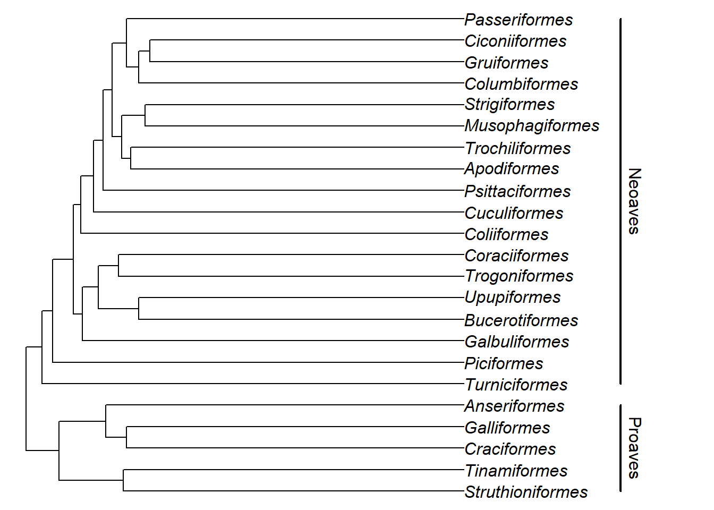

# Reconstructing the Past


<script src="js/hideOutput.js"></script>


How can we use genetics and genomics to understand the evolutionary history of organisms? Although evolutionary change can be rapid, it mainly occurs on a timescale that extends far beyond the average human lifespan. For this reason, we must turn to other means in order to reconstruct a picture of the evolutionary history of species and populations. In this tutorial, we will focus on two such methods. The first of these is phylogenetic analysis as a means to visualise the evolutionary relationships among species. We will then turn to principal components analysis, a popular method for examining the variation we see in genomic data and a first step for gaining insight into the processes that might have led to the evolution of such structure within or between species.

### What to expect {.unnumbered}

In this section we will:

-   learn some tools for visualising phylogenetic trees
-   learn how to create phylogenies
-   perform a PCA on genomic data

### Getting started {.unnumbered}

As always, we need to set up our R environment. We'll load `tidyverse` as usual, but we will also need a few more packages today to help us handle different types of data. Chief among these is `ape` which is the basis for a lot of phylogenetic analysis in R. We will also load another phylogenetic package, `phangorn` (which has an extremely [geeky reference](https://en.wikipedia.org/wiki/Fangorn) in its name). The package `adegenet` will also be used to perform some population genomic analyses and since these are quite computationally intensive, we will also install and load `parallel` - a package that allows R to run computations in parallel to speed up analysis.


```r
# clear the R environment
rm(list = ls())

# install new packages
install.packages("ape")
install.packages("phangorn")
install.packages("adegenet")
install.packages("parallel")

# load packages
library(ape)
library(phangorn)
library(adegenet)
library(tidyverse)
library(parallel)
```

With these packages installed, we are ready to begin!

## Phylogenetics in R


<script src="js/hideOutput.js"></script>


R has a number of extremely powerful packages for performing phylogenetic analysis, from plotting trees to testing comparative models of evolution. You can see [here](https://cran.r-project.org/web/views/Phylogenetics.html) for more information if you are interested in learning about what sort of things are possible. For today's session, we will learn how to handle and visualise phylogenetic trees in R. We will also construct a series of trees from a sequence alignment. First, let's familiarise ourselves with how R handles phylogenetic data.

### Storing trees in R

The backbone of most phylogenetic analysis in R comes from the functions that are part of the `ape` package. `ape` stores trees as `phylo` objects, which are easy to access and manipulate. The easiest way to understand this is to have a look at a simple phylogeny, so we'll create a random tree now.


```r
# set seed to ensure the same tree is produced
set.seed(32)
# generate a tree
tree <- rtree(n = 4, tip.label = c("a", "b", "c", "d"))
```

What have we done here? First, the `set.seed` function just sets a seed for our random simulation of a tree. You won't need to worry about this for the majority of the time, here we are using it to make sure that when we randomly create a tree, we all create the same one.

What you need to focus on is the second line of code that uses the `rtree` function. This is simply a means to generate a random tree. With the `n = 4` argument, we are simply stating our tree will have four taxa and we are already specifying what they should be called with the `tip.label` argument.

Let's take a closer look at our `tree` object. It is a `phylo` object - you can demonstrate this to yourself with `class(tree)`.


```r
tree
#> 
#> Phylogenetic tree with 4 tips and 3 internal nodes.
#> 
#> Tip labels:
#>   c, a, d, b
#> 
#> Rooted; includes branch lengths.
```

By printing `tree` to the console, we see it is a tree with 4 tips and 3 internal nodes, a set of tip labels. We also see it is rooted and that the branch lengths are stored in this object too.

You can actually look more deeply into the data stored within the `tree` object if you want to. Try the following code and see what is inside.


```r
str(tree)
objects(tree)
tree$edge
tree$edge.length
```

It is of course, much easier to understand a tree when we visualise it. Luckily this is easy in R.


```r
plot(tree)
```


In the next section, we will learn more about how to plot trees.

### Plotting trees

*In this section, we show various ways to control the appearance of phylogenetic trees. The plots are hidden by default to avoid extensive scrolling, click "show plot" to see them! Or better, run the code yourself, try to change some arguments and see what happens.*


<script src="js/hideOutput.js"></script>


We can actually do a lot with our trees in R using a few simple plot commands. Let's generate another random tree, this time with 5 taxa.

::: {.fold .o}

```r
# set seed to ensure the same tree is produced
set.seed(32)
# generate a tree
tree <- rtree(n = 5, tip.label = c("a", "b", "c", "d", "e"))
```

First of all, let's plot our new tree using the default plot settings. Except unlike last time, we will suppress the branch lenghts.


```r
# plot tree and suppress branch lengths
plot(tree, use.edge.length = FALSE)
```


All we did here was set the `use.edge.length` argument to false, suppressing the branch lengths. The standar tree plot that `ape` creates is a **phylogram**. However, there are a number of other different plotting methods we can use.

We can plot a **cladogram** for example.


```r
# plot cladogram
plot(tree, type = "cladogram", use.edge.length = FALSE)
```


We can plot our tree as if it had no root.


```r
# plot unrooted
plot(tree, type = "unrooted", use.edge.length = FALSE)
```


We can also make a radial tree, which is a convenient way to plot many taxa at once.


```r
# plot fan/radial treee
plot(tree, type = "fan", use.edge.length = FALSE)
```


We can also easily set many different graphical parameters to make our tree look a specific way. So for example


```r
# plot red tree (with suppressed branch lengths)
plot(tree, use.edge.length = FALSE, edge.width = 2, edge.color = "red")
```


### Manipulating trees

As well as simply plotting trees, it is possible to manipulate them to make them look a certain way or to focus on a specific group of taxa. `ape` has a number of powerful functions that allow us to do this quite easily. To start, let's make a new random tree, this time with 5 taxa.


```r
# set seed (to ensure the same tree is drawn for all)
set.seed(32)
# make a new tree with 5 tips - one is root
tree <- rtree(n = 5, tip.label = c("a", "b", "c", "d", "e"))
# plot the tree
plot(tree)
```


Let's say we want to remove a tip from our tree - we can easily achieve this with the `drop.tip` function, and supplying the name of the tip.


```r
# drop a tip 
prune_tree <- drop.tip(tree, "d")
plot(prune_tree)
```


Perhaps we want to rotate our tree, so that the tips are orientated slightly differently? This is also very easily achieved with the `rotate` function.


```r
# rotate tree
prune_tree1 <- rotate(prune_tree, c("b", "a"))
# plot newly rotate tree
plot(prune_tree1)
```


Here, we specified we want the tree rotated on the internal node that joins `a` and `b`, which in this case is the root of the tree. What if we want to rotate another set of taxa, such as `c` and `e`? Well it is actually much more straightforward to specify the **node** rather than the tip names. But how can you know the names of each of the nodes? Luckily there is an easy way to display them.


```r
# show nodes on tree
plot(prune_tree1)
nodelabels()
```


So we want to rotate our tree on node 7. Thus we can rerun the code using `rotate` but this time with the node specified, not the tips:


```r
# rotate tree specifying node
prune_tree2 <- rotate(prune_tree1, 7)
# plot newly rotate tree
plot(prune_tree2)
```


Note that rotating trees just alters the way we plot them, it does not make any difference to the evolutionary relationship among the taxa shown on them.


```r
# set seed
set.seed(32)
# make a random tree of three taxa
tree <- rtree(n = 3, tip.label = c("a", "b", "c"))
# set up plot layout
par(mfrow = c(3, 1))
# plot the tree
plot(tree, use.edge.length = FALSE, cex = 1.5, no.margin = TRUE)
plot(rotate(tree, 4), use.edge.length = FALSE, cex = 1.5, no.margin = TRUE)
plot(rotate(tree, 5), use.edge.length = FALSE, cex = 1.5, no.margin = TRUE)
```


```r
# set layout back to normal
par(mfrow = c(1, 1))
```

Note that `cex` just alters the size of the tip labels and `no.margin = TRUE` suppresses the use of margins for visualisation. All three of these trees are the same - they are just rotated differently.
:::

### A simple example with real data - avian phylogenetics

So far, we have only looked at randomly generated trees. Let's have a look at some data stored within `ape` - a phylogeny of birds at the order level.


```r
# get bird order data
data("bird.orders")
```

Let's plot the phylogeny to have a look at it. We will also add some annotation to make sense of the phylogeny.


```r
plot(bird.orders, no.margin = TRUE)
segments(38, 1, 38, 5, lwd = 2)
text(39, 3, "Proaves", srt = 270)
segments(38, 6, 38, 23, lwd = 2)
text(39, 14.5, "Neoaves", srt = 270)
```



Here, the `segments` and `text` functions specify the bars and names of the two major groups in our avian phylogeny. We are just using them for display purposes here, but if you'd like to know more about them, you can look at the R help with `?segments` and `?text` commands.

Let's focus on the Neoaves clade for now. Perhaps we want to test whether certain families within Neoaves form a monophyletic group? We can do this with the `is.monophyletic` function.


```r
# Parrots and Passerines?
is.monophyletic(bird.orders, c("Passeriformes", "Psittaciformes"))
#> [1] FALSE
# hummingbirds and swifts?
is.monophyletic(bird.orders, c("Trochiliformes", "Apodiformes"))
#> [1] TRUE
```

We can also easily subset our tree using `extract.clade`. Let's extract the Neoaves and then plot them. We need to supply the correct node to `extract.clade`, so let's first find the correct node by plotting nodelabels on top of the previous tree.


```r
plot(bird.orders, no.margin = TRUE)
segments(38, 1, 38, 5, lwd = 2)
text(39, 3, "Proaves", srt = 270)
segments(38, 6, 38, 23, lwd = 2)
text(39, 14.5, "Neoaves", srt = 270)
nodelabels()
```


We can see that the Neoaves start at node 29, so let's extract that one.


```r
# extract clade
neoaves <- extract.clade(bird.orders, 29)
# plot
plot(neoaves)
```


The functions provided by `ape` make it quite easy to handle phylogenies in R, feel free to experiment further to find out what you can do!

### Constructing trees with R

So far, we have only looked at examples of trees that are already constructed in some way. However, if you are working with your own data, this is not the case - you need to actually make the tree yourself. Luckily, `phangorn` is ideally suited for this. We will use some data, bundled with the package, for the next steps. The following code loads the data:

::: {.yellow}

```r
# get phangorn primates data
fdir <- system.file("extdata/trees", package = "phangorn")
primates <- read.dna(file.path(fdir, "primates.dna"), format = "interleaved")
```
:::

This is a set of 14 mitochondrial DNA sequences from 12 primate species and 2 outgroups - a mouse and a cow. The sequences are 232 basepairs long. The data is originally from [this paper](https://academic.oup.com/mbe/article/5/6/626/1044336) and is a well-known example dataset in phylogenetics.

We have seen the structure this data is stored in before - it is a `DNA.bin` object like we worked with in [Chapter 7](https://evolutionarygenetics.github.io/Chapter7.html).

Print `primates` to your screen and have a look at it. For the next section, we will use just four species - the hominidae (i.e. Orangutan, Gorilla, Chimpanzee and Human). Let's subset our data in order to do that.


```r
# subset data to get hominidae
hominidae <- primates[11:14, ]
```

We also need to convert our dataset so that `phangorn` is able to use it properly. The package uses a data structure called `phyDAT`. Luckily conversion is very easy indeed:


```r
# convert data
hominidae <- as.phyDat(hominidae)
```

::: {.blue}
**Droppe?**\
We are going to create two types of trees - UPGMA and Neighbour Joining. These are distance based measures and so we must first make a distance matrix among our taxa, which requires a substitution model. The default substitution model is the Jukes & Cantor model, but we can also use Felsenstein's 1981 model. Which is the best to apply here? To find that out, we should first test the different models using `modelTest`:


```r
# perform model selection
hominidae_mt <- modelTest(hominidae, model = c("JC", "F81"), G = FALSE, I = FALSE)
```

Take a look at the `hominidae_mt` table. What we have done here is performed a maximum likelihood analysis and a form of model selection to determine which of the two models we tested - JC69 and F81 (specified by `model = c("JC", "F81")`) best fits our data. We also set `G` and `I` to false in order to simplify the output. Don't worry too much about what these are for now, but feel free to use `?modelTest` if you wish to learn more.

Anyway, how can we interpret this table? Well, we are looking for the model with the \*\* log likelihood\*\* closest to zero and also the lowest value of AIC (Akaike information criterion - [see here for more information](https://en.wikipedia.org/wiki/Akaike_information_criterion)). In this case, it is clear that F81 is a better fit for the data than the JC model, so we will calculate our distance matrix with this model instead.
:::

We can now calculate evolutionary distance using `dist.ml` - a function that compares pairwise distances among sequences the substitution model we chose.


```r
# first generate a distance matrix
hominidae_dist <- dist.ml(hominidae, model = "F81")
```

Take a look at `hominidae_mt` - you will see it is a matrix of the distance between the sequences - i.e. in terms of the number of nucleotide substitions. Next we can create our trees. For an UPGMA tree, we use the `upgma` function:


```r
# upgma tree
hom_upgma <- upgma(hominidae_dist)
```

Next we will make a neighbour joining tree. This is easily done with the `NJ` function.


```r
# NJ tree
hom_nj <- NJ(hominidae_dist)
```

Now that we have created both of our trees, we should plot them to have a look at them.


```r
# plot them both
par(mfrow = c(2, 1))
plot(hom_upgma, no.margin = TRUE)
plot(hom_nj, no.margin = TRUE)
```


```r
par(mfrow = c(1,1))
```

However, you will remember that the neighbour joining algorithm produces an unrooted phylogeny. This means the way we plotted it above is incorrect. We can verify that the tree is unrooted (compared to the UPGMA tree) using the `is.rooted` function.


```r
# check whether the tree is rooted
is.rooted(hom_nj)
is.rooted(hom_upgma)
```

So it makes more sense to plot our tree as unrooted. We do this below.


```r
# plot nj unrooted
plot(hom_nj, type = "unrooted")
```


We can also set a root on our tree, if we know what we should set the outgroup to. In this case, we can set our outgroup to Orangutan, because we know it is the most divergent from the clade that consists of humans, chimps and gorillas.

We will set the root of our neighbour joining tree below using the `root` function and we'll then plot it to see how it looks.


```r
# plot nj rooted
hom_nj_r <- root(hom_nj, "Orang")
plot(hom_nj_r)
```


In this case, it hasn't actually made a huge difference to our tree topology, but with a larger dataset, it might do.

As a final point here, we might want to try and compare our two trees and see which we should accept as the best model for the evolutionary relationships among our taxa. One way to do this is to use the **parsimony score** of a phylogeny. Essentially, the lower the parsimony score is for a tree, the more parsimonious explanation of the data it might be. This is very easy to achieve with the `parsimony` function.


```r
# calculate parsimony
parsimony(hom_upgma, hominidae)
parsimony(hom_nj, hominidae)
```

For the `parsimony` function, the first argument is the tree, the second is the data. Here we can that both parsimony scores are equal for the two trees, suggesting that they are both equivalent models of the evolutionary relationships among the taxa we are studying here.

## Population structure


<script src="js/hideOutput.js"></script>


Examining population structure can give us a great deal of insight into the history and origin of populations. Model-free methods for examining population structure and ancestry, such as [**principal components analysis**](https://en.wikipedia.org/wiki/Principal_component_analysis) are extremely popular in population genomic research. This is because it is typically simple to apply and relatively easy to interpret. Essentially, PCA aims to identify the main axes of variation in a dataset with each axis being independent of the next (i.e. there should be no correlation between them). The first component summarizes the major axis variation and the second the next largest and so on, until cumulatively all the available variation is explained. In the context of genetic data, PCA summarizes the major axes of variation in allele frequencies and then produces the coordinates of individuals along these axes. For the rest of the tutorial we will conduct a PCA to demonstrate how it can help give insight to population structure within species.

### Village dogs as an insight to dog domestication

To demonstrate how a PCA can help visualise and interpret population structure, we will use a dataset adapted from that originally used by [Shannon et al. (2015)](http://www.pnas.org/content/112/44/13639) to examine the genetic diversity in a worldwide sample of domestic dogs. All of us are familiar with domestic dogs as breeds and pets, but it is easy to overlook the fact that the majority of dogs on earth are in fact free-roaming, human commensals. Rather than being pets or working animals, they just live alongside humans and are [equally charming](https://en.wikipedia.org/wiki/Free-ranging_dog).

In their study, [Shannon et al. (2015)](http://www.pnas.org/content/112/44/13639) surveyed hundreds of dogs from across the world, focusing mainly on village dogs in developing countries. Since domestic dog breeds are often characterised by severe bottlenecks and inbreeding, they lack a lot of the diversity that would have been present when the first became a domestic species. In contrast, village dogs are unlikely to have undergone such bottlenecks and so might represent a more broad sample of the true genetic diversity present in dogs.

The researchers used a SNP chip and previously published data to collate variant calls from over 5,406 dogs at 185,805 SNP markers. Of the 5,406 dogs, 549 were village dogs. It is these free-roaming dogs we will focus on today.

### Reading the data into R

In order to run our PCA analysis, we will need to use `adegenet`. However, the full dataset is much too large to read, so instead we will use a smaller subsetted dataset. We will read in a special format of SNP data produced by a program called [PLINK](https://www.cog-genomics.org/plink/1.9/). Don't worry too much about the data format for now - our main aim is to get it into R. However, feel free to explore the PLINK website if you are interested.

We will need a [**plink raw file**](https://evolutionarygenetics.github.io/village_subsample.raw) and also a [**plink map file**](https://evolutionarygenetics.github.io/village_subsample.map) for our dog data. Follow the links to download the data and then use the `read.PLINK` function below to read them in. (if you're on a mac, and think this goes too slowly, try changing the `parallel` argument to `TRUE`)

::: {.yellow}

```r
# read in the dog data
dogs <- read.PLINK(file = "./village_subsample.raw", 
                   map.file = "./village_subsample.map", parallel = FALSE,
                   chunkSize = 2000)
#> 
#>  Reading PLINK raw format into a genlight object... 
#> 
#> 
#>  Reading loci information... 
#> 
#>  Reading and converting genotypes... 
#> .
#>  Building final object... 
#> 
#> ...done.
```
:::

Running the function will create a `genlight` object - a special data structure for `adegenet`. If you call the `dogs` object, you will see some summary information and also the number of individuals and markers. As you will see, we have subsampled this data to make it more feasible to run an analysis in R.

### Performing a PCA

With `adegenet`, we can perform PCA on our genomic data with the `glPCA` function.


```r
# perform pca on dogs
dogs_pca <- glPca(dogs, parallel = T, nf = 20)
```

Here again we use `parallel = T` to use parallel processing. We also use `nf = 20` in order to tell the function we want to retain 2 principal components.

Let's take a moment to look at the output of our PCA analysis.


```r
# look at pca object
objects(dogs_pca)
```

Our `dogs_pca` object is a list with four elements. We can ignore `call` - that is just the call to the function we performed above. `eig` returns the eigenvalues for all the principal components calculated (not just the ones retained). We can use this to get an idea of how much of the variance each principal compnent explains and we will do so in a moment. `loadings` is a matrix of how the SNPs load onto the PC scores - i.e. how their changes in allele frequency effect the position of the data points along the axis. Finally the `scores` matrix is the actual principal component scores for each individual, allowing us to actually see how the invidivudals are distributed in our analysis.

For now, let's have a look at how much variance our principal components explain. First, we need to convert our eigenvectors into percentages of variance explained.


```r
eig <- dogs_pca$eig
# calculate percentage of variance explained
eig <- (eig/sum(eig))*100
```

From examining `eig`, we can see how much variance each principal component explains. So for example, PC1 explains 4.59% of the variance and PC2 3.04%. Each PC cumulatively explains more of the variance until all 100% of it is explained. You can see this by running `sum(eig)` and seeing that the total is 100.

A total of 7.63% for the first two vectors sounds small, but it is actually quite an appreciable amount of variance. Typically, we would concentrate on the PC components that together account for at least 10% of the variance.

### Visualising the PCA

Plotting a PCA is the best way to properly interpret it, so we will do this now. The first thing we should do is extract the **principal component scores** from the data.


```r
# create an id vector
id <- row.names(dogs_pca$scores)
# get the pc scores - only the first two for now
pc <- dogs_pca$scores[, 1:2]
# make a tibble
my_pca <- as.tibble(data.frame(id, pc))
```

We can then easily plot this using `ggplot`.


```r
# plot with ggplot2
ggplot(my_pca, aes(PC1, PC2)) + geom_point() + theme_light()
```


OK - so this plot looks interesting, but it is lacking some key information - namely we should colour the points by their location so we can actually have some hope of understanding it. To do this, we need information on the location that the dogs are sampled. Luckily, we have prepared that for you and you can download it [here](https://evolutionarygenetics.github.io/village_dogs.tsv). Then read it in like so:


```r
# read in village dog data
village_data <- read_delim("./village_dogs.tsv", delim = "\t")
```

Take a moment to look at this. It has three columns, `id`, `breed` and `location`. Our `my_pca` object also has an id column, so we need to join the two datasets. Luckily, this is really easy with a `tidyverse` function called `left_join`:


```r
# join pca and village dog data
village_pca <- inner_join(village_data, my_pca, by = "id")
```

Now we can easily plot the PCA using `ggplot` and at the same time, colour the points by the location they were sampled in.


```r
# plot with ggplot2
a <- ggplot(village_pca, aes(PC1, PC2, colour = location)) + geom_point() + theme_light()
a + theme(legend.position = "bottom")
```


So from this PCA, what can we deduce? Well an immediate obvious pattern is that dogs from Central and Eastern Asia are quite divergent from other geographic locations. Similarly, African and European dogs seem to form their own clusters. In the original paper, [Shannon et al. (2015)](http://www.pnas.org/content/112/44/13639) suggest that the origin of dog domestication might actually be in Central Asia. This is hard to deduce from the PCA but it is clear that there is geographical structure among village dogs.

The picture may be even clearer if we use the full dataset. Since this is very large, we cannot perform this PCA in R. However, we have conducted this for you and you can find the full PCA dataset [here](https://evolutionarygenetics.github.io/full_village_dogs_pca.tsv). You can also find the eigenvectors [here](https://evolutionarygenetics.github.io/full_village.eigenval). To give you a head start, you can read in the eigenvalues like so:


```r
full_village_eigenval <- scan("./full_village.eigenval")
```

## Study questions

For study questions on this tutorial, download the `Chapter9_R_questions.R` from Canvas or find it [here](https://evolutionarygenetics.github.io/Chapter9_R_questions.R).

## Going further

-   [A short tutorial on phylogenetics in R and also with some comparative phylogenetic functions](http://www.phytools.org/eqg/Exercise_3.2/)
-   [Going further with phylogenetics in R - plus links to other tutorials](https://www.molecularecologist.com/2016/02/quick-and-dirty-tree-building-in-r/)
-   [ggTree - a package for more elegant tree drawing in R](https://www.molecularecologist.com/2017/02/phylogenetic-trees-in-r-using-ggtree/)
-   [A series of tutorials for running analyses (including PCA) in adegenet](https://github.com/thibautjombart/adegenet/wiki/Tutorials)
