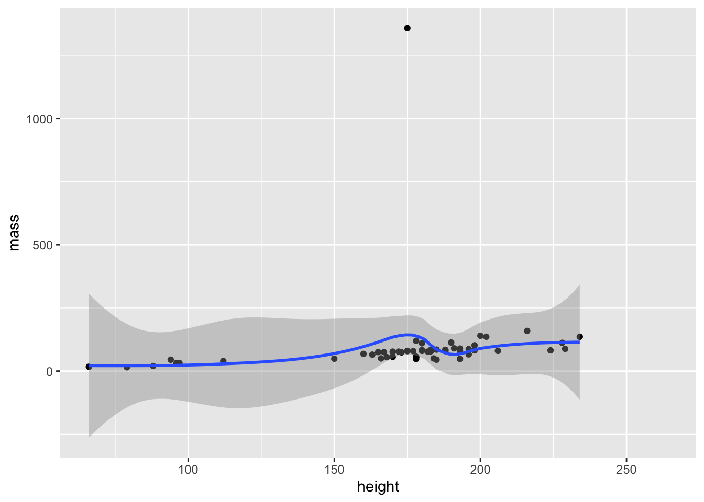
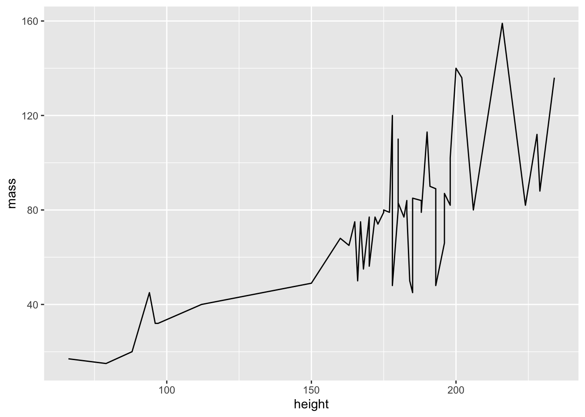
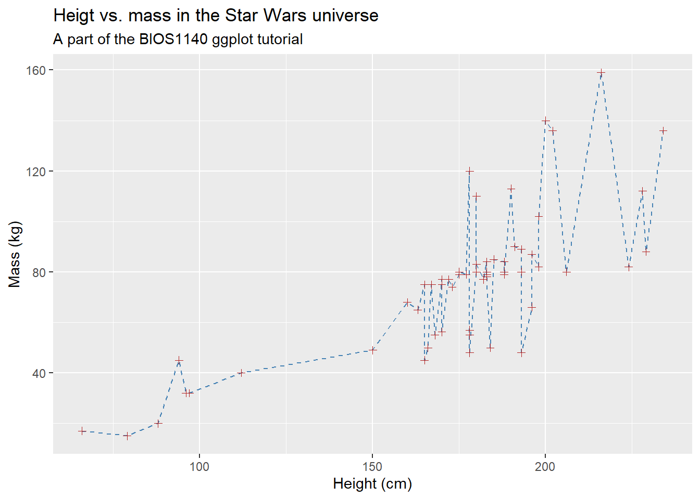
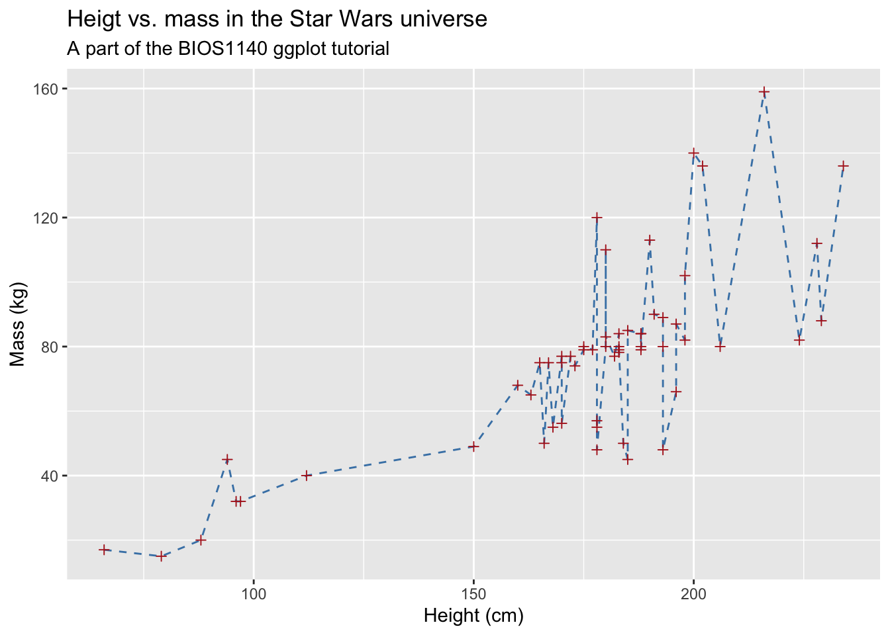
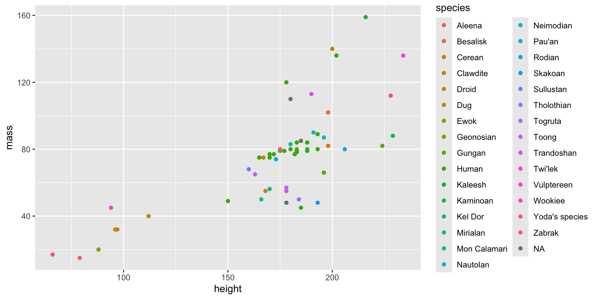
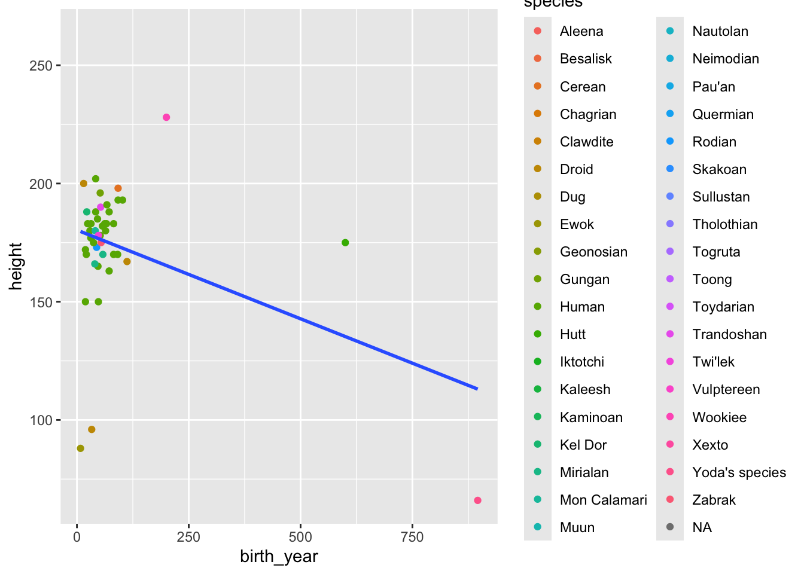
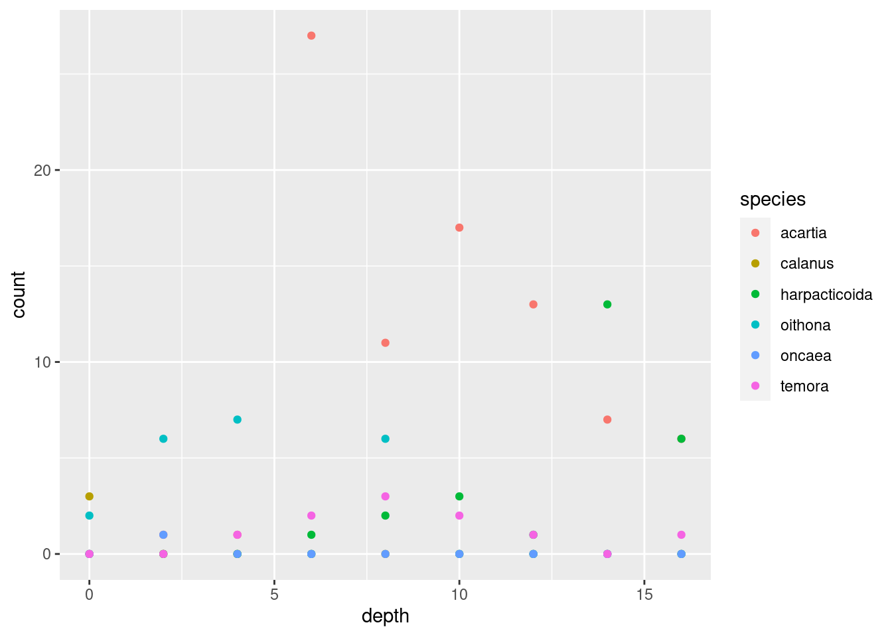
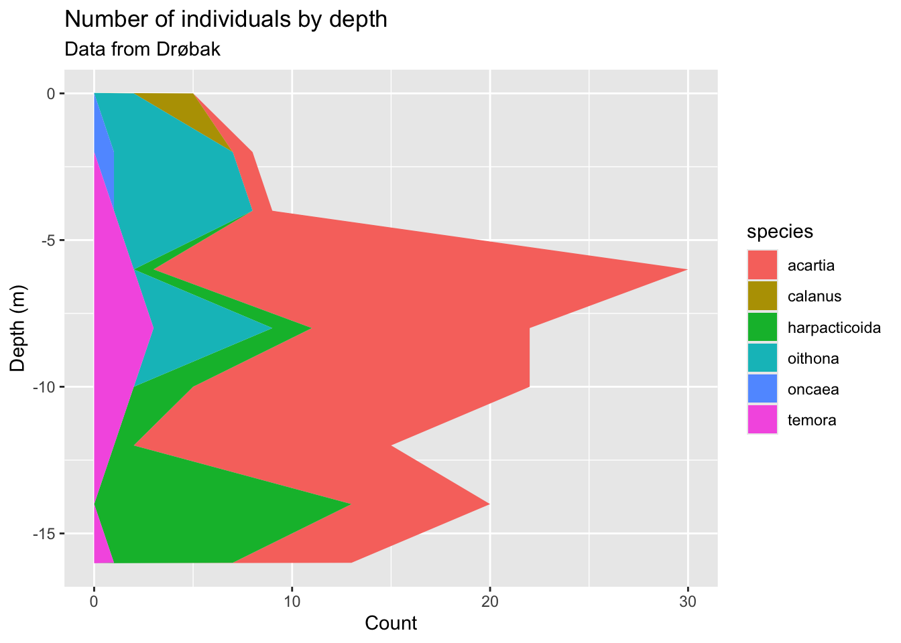

# Building on your foundations: going further with R {#ch02}


<script src="js/hideOutput.js"></script>


In the last chapter, we got to grips with the basics of R. Hopefully after completing the basic introduction, you feel more comfortable with the key concepts of R. Don't worry if you feel like you haven't understood everything - this is common and perfectly normal! Learning R is very much like learning a real language in that it takes time and practice to feel 'fluent'. Even if you do feel comfortable in the language, there is no shame in asking for help or looking for more information to develop your understanding. As regular R users, we still look things up constantly and there are one or two basics which we still forget, even with over a decade of experience of using the R environment! With this in mind, a goal of these R tutorials is to re-emphasise and reinforce basic concepts throughout. We will introduce concepts but through the practical demonstrations of code, we will underline them again and again.

In future chapters, we will be using a similar approach to reinforce the evolutionary genetic concepts you have encountered in the book. However, for this chapter we remain solely in the R environment and will instead switch our focus to more advanced features of R. Advanced does not necessarily mean more complicated - but it does mean that you need to have at least been introduced to the basic concepts. We will first 'level-up' our approach to handling and manipulating data. For this, we will be borrowing heavily from the [tidyverse](https://www.tidyverse.org) - a collection of packages and principles for data science in R. We will also introduce you to more advanced plotting, comparing the two most popular apporaches for plots - `base` and `ggplot`.

### What to expect {.unnumbered}

In this section we are going to:

-   explore more advanced methods of handling and manipulating data
-   learn how to plot data using `ggplot2`
-   learn how to reshape data with `pivot_longer()`

## Intro to data manipulation with tidyverse


<script src="js/hideOutput.js"></script>

Data manipulation might seem quite a boring topic but it is actually a crucial part of data science and increasingly, bioinformatics and evolutionary biology. For the average researcher working with biological data, we would estimate that the vast majority of analysis time is spent handling the data. By handling and manipulation, we mean exploring the data, shaping it into a form we want to work with and extracting information we find important or interesting. Getting to know your data is absolutely fundamental to properly understanding it and that is why we have decided to dedicate time to it in this chapter.

At this point in our tutorial, we will use a series of packages collectively known as the [tidyverse](https://www.tidyverse.org); in particularly, we will focus on functions from a tidyverse package called `dplyr`. These packages grew from the approach of [Hadley Wickham](http://hadley.nz/) - a statistician responsible for popularising fresh approaches to R and data science. As with nearly all things in R, there are many, many ways to achieve the same goal and the guidlines we give here are by no means definitive. However, we choose to introduce these principles now because in our experience of data analysis, they have greatly improved our efficiency, the clarity of our R code and the way we work with data.

### What is the tidyverse?

It's important to emphasize that the tidyverse set of packages can do mostly **the same as base R already can do**. So what's the difference? While base R is a collection of different methods and functions built up over years, tidyverse is designed with a specific philosophy in mind. This leads to having a consistent approach to solving problems that many find appealing. That being said, if you find you prefer the "regular" R-functions over their tidyverse equivalents, go ahead and use those instead, there's nothing wrong with that.

::: {.green}
**Important concept:**\
The tidyverse packages can do more or less exactly the same as base R. The difference is that tidyverse approaches problems with a specific philosophy. Some key points of this philosophy is:

-   The name of all functions that transform data are verbs
-   The `data` argument is always the first argument of the functions, so it's easy to use in a pipeline (more on this later).
:::

### The dplyr package

`dplyr` is one of the packages in the tidyverse, and is focused on manipulating data in data frames. `dplyr` at it's core consists of combining 5 different verbs for data handling:

-   `select()` select columns from your data
-   `filter()` filters rows based on certain criteria
-   `mutate()` creates new columns (not gone through in this tutorial, but included in this list for completeness)
-   `group_by()` creates groups for summarizing data
-   `summarise()` summarises data based on the groups you have created

We will go through the use of these functions shortly. You may notice that you've already learned how to `select`, `filter` and `mutate` data last week using `[]` and `$`, which is correct, and exactly what we mean when we say that base R and `tidyverse` can do the same things.

## Using dplyr to work with your data


<script src="js/hideOutput.js"></script>

First, we have to install and load the tidyverse.[^exercise2-1]

[^exercise2-1]: Remember that you only need to install a package once, but that it needs to be loaded with `library()` every time you want to use it.


```r
install.packages("tidyverse")
library(tidyverse)
```


Together with the tidyverse, you get a built in data set called `starwars`, containing information about the characters from the Star Wars films. We will use this data set for most of this tutorial. Since it's already loaded, all you have to do to access it is run:


```r
starwars
#> # A tibble: 87 x 14
#>    name  height  mass hair_color skin_color eye_color birth_year sex   gender
#>    <chr>  <int> <dbl> <chr>      <chr>      <chr>          <dbl> <chr> <chr> 
#>  1 Luke~    172    77 blond      fair       blue            19   male  mascu~
#>  2 C-3PO    167    75 <NA>       gold       yellow         112   none  mascu~
#>  3 R2-D2     96    32 <NA>       white, bl~ red             33   none  mascu~
#>  4 Dart~    202   136 none       white      yellow          41.9 male  mascu~
#>  5 Leia~    150    49 brown      light      brown           19   fema~ femin~
#>  6 Owen~    178   120 brown, gr~ light      blue            52   male  mascu~
#>  7 Beru~    165    75 brown      light      blue            47   fema~ femin~
#>  8 R5-D4     97    32 <NA>       white, red red             NA   none  mascu~
#>  9 Bigg~    183    84 black      light      brown           24   male  mascu~
#> 10 Obi-~    182    77 auburn, w~ fair       blue-gray       57   male  mascu~
#> # ... with 77 more rows, and 5 more variables: homeworld <chr>, species <chr>,
#> #   films <list>, vehicles <list>, starships <list>
```

::: {.blue}
**Additional info:** `starwars` is a data frame like you learned about last week, but you might notice that it's printing a bit differently (e.g. with red color for `NA`, condensing the output). This is because `starwars` is a special kind of data frame introduced in the tidyverse, called a `tibble`. For all practical purposes, a tibble and a data frame is the same, so throughout this course we won't care much whether our data is contained in a tibble or a regular data frame.
:::

### The pipe

The tidyverse introduces a new operator called the pipe, which looks like this `%>%`. Conceptually, the pipe allows you to do something with your data, and then send the result to a new function which does more work, sends it to the next function and so on until you're satisfied. You can for instance use the pipe like this:


```r
x <- 1:100
x^2 %>% mean()
#> [1] 3383.5
```

This is equivalent to writing:


```r
mean(x^2)
#> [1] 3383.5
```

Basically, you are putting the left hand side of the pipe into the parentheses in the function on the right hand side. This may not seem useful right now, but as we will see later, this can make code much easier to read.

You can also assign the results of your pipe to an object like any ordinary calculation:


```r
x2_mean <- x^2 %>% mean()
```

There will be a lot of examples of using the pipe throughout this tutorial, showing how it can make quite complex code readable.

::: {.green}
**Important concept:**\
The pipe operator `%>%` allows you to send an object from the left side of the pipe to a function on the right side.
:::

### Selecting colums with `select()`

Lets say we want to choose the `name` and `homeworld` columns from our `starwars` data, how can we do that? With standard R, we might do something like this.


```r
# with names
starwars[, c('name', 'homeworld')]
# with indices
starwars[, c(1, 9)]
```

With `dplyr` we can do the following:


```r
select(starwars, name, homeworld)
#> # A tibble: 87 x 2
#>    name               homeworld
#>    <chr>              <chr>    
#>  1 Luke Skywalker     Tatooine 
#>  2 C-3PO              Tatooine 
#>  3 R2-D2              Naboo    
#>  4 Darth Vader        Tatooine 
#>  5 Leia Organa        Alderaan 
#>  6 Owen Lars          Tatooine 
#>  7 Beru Whitesun lars Tatooine 
#>  8 R5-D4              Tatooine 
#>  9 Biggs Darklighter  Tatooine 
#> 10 Obi-Wan Kenobi     Stewjon  
#> # ... with 77 more rows
```

The first argument here is your data, while the others are the columns you want to select. Note that you don't need to use the quotes `"` here, you generally don't need those for the `dplyr` functions.

`select()` becomes even more intuitive when using the pipe:


```r
starwars %>% select(name, homeworld)
```

This style of code is closer to how we would write in English: "Take the `starwars` data, and select the `name` and `homeworld` columns". From now on we will write all our `dplyr` code using the pipe.

If you want to omit a column, you can use `-` in front of its name:


```r
# choose all columns BUT name
starwars %>% select(-name)
```

`select` also has additional ways of selecting columns, some examples of this is shown below:


```r
# choose only columns containing an underscore
starwars %>% select(contains("_"))
# choose only columns beginning with "s"
starwars %>% select(starts_with("s"))
# choose only columns ending with "color"
starwars %>% select(ends_with("color"))
```

**Exercise: Use `select()` to select numeric columns, i.e. all the columns that contain numbers, and save it to an object with a meaningful name. You can do this manually by looking at the columns. If you want a challenge, see if you can figure out how to automatically select numeric columns from your data.**

::: {.fold .s}

```r
# manual method:
sw_hmb <- starwars %>% select(height, mass, birth_year)

# challenge:
sw_hmb <- starwars %>% select(where(is.numeric))

```
:::

### Filtering colums using `filter()`

Last week, you learned to filter a data set based on some criterion using the square brackets `[]`. To filter out only the humans from the `starwars` data set, you could write:


```r
starwars[starwars$species == "Human", ]
```

`dplyr`'s `filter()` function does the same thing, but with a slightly different syntax:


```r
starwars %>% filter(species == "Human")
```

This looks quite similar to using the square brackets, one notable difference being that you don't need to use `starwars$` within `filter()`, the function already understands that we are working with `starwars`.

Like with base R, you can use this to filter with the other logical operators as well, like `>` and `!=`:


```r
# get people lower than 1m tall
starwars %>% filter(height < 100)

# get all non-humans
starwars %>% filter(species != "Human")
```

You can also filter using several criteria at once, simply separate the logical statements with a comma:


```r
# get all non-humans shorter than 1m
starwars %>% filter(height < 100, species != "Human")
```

#### Combining `filter()` and `select()`

The real power of the pipe shows when you chain several operations together. To both filter and select from your data, simply first do the filtering and then pipe the result to `select`:[^exercise2-2]

[^exercise2-2]: Remember that what the pipe basically does is to put the left hand side of the pipe into the function on the right hand side. Without the pipe, filtering and selecting looks like this: `select(filter(starwars, height < 100), name, height, birth_year)`


```r
starwars %>% filter(height < 100) %>% 
  select(name, height, birth_year)
#> # A tibble: 7 x 3
#>   name                  height birth_year
#>   <chr>                  <int>      <dbl>
#> 1 R2-D2                     96         33
#> 2 R5-D4                     97         NA
#> 3 Yoda                      66        896
#> 4 Wicket Systri Warrick     88          8
#> 5 Dud Bolt                  94         NA
#> 6 Ratts Tyerell             79         NA
#> 7 R4-P17                    96         NA
```

Again, the code looks like how you would explain what you're doing: "take the starwars data, filter based on height, and select the `name`, `height` and `birth_year` columns". Note that you can have a line break after a pipe like you can inside parentheses, your code will still continue running.

**Exercise: use `filter()` to choose all the people that has "Naboo" as `homeworld`. Select name, skin_color and eye_color and save the result to an object.**

::: {.fold .s}

```r
sw_naboo_color <- starwars %>% filter(homeworld == "Naboo") %>%
  select(name, skin_color, eye_color)
```
:::

::: {.green}
**Important concept:**\
- `filter()` is used to select specific rows. Example: `filter(height < 100)` - `select()` is used to select specific columns. Example: `select(name, height)`
:::

### Grouped summaries with `group_by()` and `summarise()`

Imagine that you want to calculate the mean height of the people (and droids) in the `starwars` data set. You could use `mean()` on the column to achieve this (note the use of `na.rm` since the height column contains `NA`s):


```r
mean(starwars$height, na.rm = TRUE)
#> [1] 174.358
```

But what if you want to calculate the mean height separately for e.g. the different species? One way to do this is to do a *grouped summary*. Your group is the `species` column, and your summary statistic is `mean`. We create groups using the `group_by()` function:


```r
starwars %>% group_by(species)
#> # A tibble: 87 x 14
#> # Groups:   species [38]
#>    name  height  mass hair_color skin_color eye_color birth_year sex   gender
#>    <chr>  <int> <dbl> <chr>      <chr>      <chr>          <dbl> <chr> <chr> 
#>  1 Luke~    172    77 blond      fair       blue            19   male  mascu~
#>  2 C-3PO    167    75 <NA>       gold       yellow         112   none  mascu~
#>  3 R2-D2     96    32 <NA>       white, bl~ red             33   none  mascu~
#>  4 Dart~    202   136 none       white      yellow          41.9 male  mascu~
#>  5 Leia~    150    49 brown      light      brown           19   fema~ femin~
#>  6 Owen~    178   120 brown, gr~ light      blue            52   male  mascu~
#>  7 Beru~    165    75 brown      light      blue            47   fema~ femin~
#>  8 R5-D4     97    32 <NA>       white, red red             NA   none  mascu~
#>  9 Bigg~    183    84 black      light      brown           24   male  mascu~
#> 10 Obi-~    182    77 auburn, w~ fair       blue-gray       57   male  mascu~
#> # ... with 77 more rows, and 5 more variables: homeworld <chr>, species <chr>,
#> #   films <list>, vehicles <list>, starships <list>
```

Notice that nothing has changed in the data, but at the top you can see the text `# Groups:   species [38]`, showing that you indeed have created a group, and that you have 38 different species in your data. The main use of `group_by()` is together with `summarise()`, which does a summary based on the groups you've created:


```r
starwars %>% 
  group_by(species) %>% #create group
  summarise(mean_height = mean(height, na.rm = TRUE)) # calculate summary statistic
#> # A tibble: 38 x 2
#>    species   mean_height
#>    <chr>           <dbl>
#>  1 Aleena            79 
#>  2 Besalisk         198 
#>  3 Cerean           198 
#>  4 Chagrian         196 
#>  5 Clawdite         168 
#>  6 Droid            131.
#>  7 Dug              112 
#>  8 Ewok              88 
#>  9 Geonosian        183 
#> 10 Gungan           209.
#> # ... with 28 more rows
```

Note how again, like in `data.frame`, the argument name to `summarise` becomes the column name in your new data frame. You can use several summary functions inside `summarise()`, like `median()`, `sd()`, `sum()` and `max()` to name some. You can also do several summaries within a single `summarise()` function:


```r
starwars %>% 
  group_by(species) %>%
  summarise(mean_height = mean(height, na.rm = TRUE),
            median_height = median(height, na.rm = TRUE),
            sd_height = sd(height, na.rm = TRUE))
#> # A tibble: 38 x 4
#>    species   mean_height median_height sd_height
#>    <chr>           <dbl>         <dbl>     <dbl>
#>  1 Aleena            79             79      NA  
#>  2 Besalisk         198            198      NA  
#>  3 Cerean           198            198      NA  
#>  4 Chagrian         196            196      NA  
#>  5 Clawdite         168            168      NA  
#>  6 Droid            131.            97      49.1
#>  7 Dug              112            112      NA  
#>  8 Ewok              88             88      NA  
#>  9 Geonosian        183            183      NA  
#> 10 Gungan           209.           206      14.2
#> # ... with 28 more rows
```

We can even group by several variables, creating more detailed summaries:


```r
starwars %>%
  group_by(homeworld, sex) %>%
  summarise(mean_height = mean(height, na.rm = TRUE))
#> # A tibble: 61 x 3
#> # Groups:   homeworld [49]
#>    homeworld      sex    mean_height
#>    <chr>          <chr>        <dbl>
#>  1 Alderaan       female        150 
#>  2 Alderaan       male          190.
#>  3 Aleen Minor    male           79 
#>  4 Bespin         male          175 
#>  5 Bestine IV     male          180 
#>  6 Cato Neimoidia male          191 
#>  7 Cerea          male          198 
#>  8 Champala       male          196 
#>  9 Chandrila      female        150 
#> 10 Concord Dawn   male          183 
#> # ... with 51 more rows
```

Now you get two groups for homeworld Alderaan, one with males and one with females. For the following homeworld groups there are only males, so you just get one group for each (giving a pretty accurate picture of the gender balance in Star Wars).

#### Counting how many observations we have in our groups with `tally()`

When we have created our groups, we can also use the `tally()` function to count the number of observations we have in the groups:


```r
starwars %>% 
  group_by(species) %>%
  tally()
#> # A tibble: 38 x 2
#>    species       n
#>    <chr>     <int>
#>  1 Aleena        1
#>  2 Besalisk      1
#>  3 Cerean        1
#>  4 Chagrian      1
#>  5 Clawdite      1
#>  6 Droid         6
#>  7 Dug           1
#>  8 Ewok          1
#>  9 Geonosian     1
#> 10 Gungan        3
#> # ... with 28 more rows
```

This can be useful to get an overview of your data[^exercise2-3]

[^exercise2-3]: for example, you could realise that it doesn't make sense to calculate mean and standard deviation when you only have a single value, like we've done quite a bit

::: {.green}
**Important concept:**\
`group_by()` can be combined with different functions to give an overview of your data.

-   `group_by() %>% summarise()` does some calculation in each group. Example: `group_by(homeworld, sex) %>% summarise(mean_height = mean(height))`
-   `group_by() %>% tally()` counts the number of observations in the groups. Example: `group_by(species) %>% tally()`
:::

### Using everything we've learned in a single pipe, and a `dplyr` exercise

One advantage of pipes is that you can do everything you want in a single operation[^exercise2-4]. Below is an example using everything we've learned so far in a single pipe.

[^exercise2-4]: In practice, it's probably smart to make an object of your intermediary results every now and then.


```r
starwars %>%
  select(-films, -vehicles, -starships) %>%
  filter(species == "Human") %>%
  group_by(sex) %>%
  summarise(mean_height = mean(height, na.rm = TRUE))
#> # A tibble: 2 x 2
#>   sex    mean_height
#>   <chr>        <dbl>
#> 1 female        160.
#> 2 male          182.
```

**Exercise: Explain to another student what happens in the code above (or write it down if you're doing this on your own).**

**Exercise: Take the starwars data set, filter so you keep all that are *below the mean height*. Then, calculate the mean height of these short individuals, grouped by homeworld.**

<details>

<summary>

Show hint

</summary>

You can supply the mean height to the logical statement inside `filter()`. Your filtering step should then look like this: `filter(height < mean(height, na.rm = TRUE))`

</details>

::: {.fold .s}

```r
starwars %>%
  filter(height < mean(height, na.rm = TRUE)) %>%
  group_by(homeworld) %>%
  summarise(mean_height = mean(height, na.rm = TRUE))
#> # A tibble: 19 x 2
#>    homeworld   mean_height
#>    <chr>             <dbl>
#>  1 Alderaan           150 
#>  2 Aleen Minor         79 
#>  3 Chandrila          150 
#>  4 Corellia           170 
#>  5 Coruscant          168.
#>  6 Endor               88 
#>  7 Iridonia           171 
#>  8 Malastare          112 
#>  9 Mirial             168 
#> 10 Naboo              151.
#> 11 Rodia              173 
#> 12 Sullust            160 
#> 13 Tatooine           153.
#> 14 Toydaria           137 
#> 15 Troiken            122 
#> 16 Tund               163 
#> 17 Vulpter             94 
#> 18 Zolan              168 
#> 19 <NA>                81
```
:::

## Plotting your data with `ggplot2`


<script src="js/hideOutput.js"></script>

In the last chapter, we learned that R is highly versatile when it comes to plotting and visualising data. Visualistation really cannot be understated - as datasets become larger and more difficult to handle, it is imperative you learn how to effectively plot and explore your data. This obviously takes practice, but plotting and summarising data visually is a key skill for guiding further analysis - this is especially true for evolutionary genomics but is easily applicable to any number of scientific fields.

As you may have gathered by now, there are lots of opinions on how to use R - whether you should use base or tidyverse approaches. We want to stress that there is nothing wrong with using base plotting, it is capable of some very impressive plots (use `demo(graphics)` to have a look). However `ggplot2` is extremely flexible and takes quite a different approach to plotting compared to baseR.

### The three things you need in a ggplot

You need three basic elements to construct a ggplot:[^exercise2-5]

[^exercise2-5]: There are more you *could* use, but these three are the ones that are strictly necessary.

1.  **Data:** this is your data set, and it *has to be contained in a data frame.*
2.  **Variables:** You need variables to plot on the x and y axes (mapping of variables)
3.  **Geometry:** You need some graphics in your plot: points, lines, boxplots, histograms etc.

Let's now use these three elements step-by-step to build up our plot. In our example, we want to make a scatterplot (plot with points) of height vs. mass in our `starwars` data set.

#### Data

First, we try supplying our data, `starwars`. The data is provided as an argument to the `ggplot()` function.


```r
ggplot(data = starwars)
```


As you can see, this results in a completely empty plot (because, like I said, we need two more things).

#### Variables

The variables are provided to the `mapping` argument of `ggplot()`. For reasons we won't discuss here, **all variables always have to be contained within the function `aes()`**. Let's try providing variables to our plot:


```r
ggplot(data = starwars, mapping = aes(x = height, y = mass))
```


Now we're getting somewhere! We have axes now, but we're still missing our points. Time to add the geometry.

#### Geometry

The geometry of a ggplot aren't provided to the `ggplot()` function as arguments. Instead, a separate function is added to the plot using `+`. All the functions for adding geometry start with `geom_`, and the one for points is called `geom_point()`. We add this to our plot:


```r
ggplot(data = starwars, mapping = aes(x = height, y = mass)) + geom_point()
```


Wohoo, we now have the plot we set out to make! There's an obvious outlier in the `mass` department, which we'll deal with later.

The philosophy behind adding geometry with a `+` is that you build up your plot, layer by layer. We could for example add a regression line in addition to points in our plot:


```r
ggplot(data = starwars, mapping = aes(x = height, y = mass)) + 
  geom_point() + #add points
  geom_smooth()  #add regression line
```



We could keep adding layers like this forever, as long as we felt we had some meaningful stuff to add.[^exercise2-6] Notice how we can have line breaks in our code after the `+`, the plot still executes.

[^exercise2-6]: Like this!

    
    ```r
    ggplot(data = starwars, mapping = aes(x = height, y = mass)) + 
      geom_point() + 
      geom_line() +
      geom_text(aes(label = name)) +
      geom_boxplot() +
      geom_violin() +
      geom_smooth()
    ```
    
    

    I know, I know, I did say "meaningful"

::: {.green}
**Important concept:**\
You need 3 things for a ggplot:

1.  **data** in a data frame (the `data` argument of `ggplot()`)
2.  **variables** -- which columns of your data do you want to plot? (the `mapping` argument of `ggplot()`, needs to be wrapped in `aes()`)
3.  **geometry** -- how do you want to represent your variables (separate functions, starting with `geom_`). You can add as many layers of geometry as you'd like.
:::

#### Interlude: filtering out the outlier

Before we continue, we should investigate our outlier, and remove it from our data to better see the pattern between mass and height.

**Exercise: Use the `dplyr` tools you learned earlier to find out who the outlier is, and make a subset of the data without that individual. Then, remake the plot with your subsetted data.**

<details>

<summary>

Show hint

</summary>

You know that the individual in question is really heavy. Use `filter()` on the `mass` column to find it!

</details>

::: {.fold .s .o}

```r
# find individuals with mass larger than 1000
starwars %>% filter(mass > 1000) %>%
  select(name, mass)
#> # A tibble: 1 x 2
#>   name                   mass
#>   <chr>                 <dbl>
#> 1 Jabba Desilijic Tiure  1358

# If you’ve seen Star Wars, the answer to this shouldn’t be a huge surprise… 
# Let’s filter him out of the data

starwars2 <- starwars %>% filter(mass < 1000)

# and plot it

ggplot(data = starwars2, mapping = aes(x = height, y = mass)) + geom_point()
```


:::

### Storing ggplots in objects

A very useful feature of ggplots is that they can be stored in objects just like any other data. We will test this with the `starwars2` data frame we created above.


```r
sw_plot <- ggplot(data = starwars2, mapping = aes(x = height, y = mass))
sw_plot
```


We can now use this object as a base, and make different plots by adding `geom`s:

::: {.fold .o}

```r
# plot with points
sw_plot + geom_point()
```


```r
# plot with line
sw_plot + geom_line()
```



```r
# plot with regression line
sw_plot + geom_smooth()
```


:::

If you plan to make several plots with the same data and variables, you should save the basic plot to an object to avoid repeating yourself.

### Customizing your plots

#### General customization

So far, we've been using the `geom_` functions without arguments, but they actually take many of the same arguments as `plot()`. This means that you can use `col` to change color, `pch` to change point shape and `lty` to change line type:


```r
# create basic plot object
sw_plot <- ggplot(data = starwars2, mapping = aes(x = height, y = mass))

# add lines and points, and customize these
sw_pts_ln <- sw_plot + 
  geom_line(col = "steelblue", lty = 2) +
  geom_point(col = "firebrick", pch = 3)

# print plot
sw_pts_ln
```


Adding title and labels can be done by adding a separate function, `labs()`. `labs()` has, among others, the arguments `x`, `y`, `title` and `subtitle`, doing exactly what you would expect:[^exercise2-7]

[^exercise2-7]: Notice how our plot is built up layer by layer. Just to remind you, here's how the code for our plot would look without creating intermediary objects:

    
    ```r
    ggplot(data = starwars2, mapping = aes(x = height, y = mass)) +
      geom_line(col = "steelblue", lty = 2) +
      geom_point(col = "firebrick", pch = 3) +
      labs(x = "Height (cm)",
           y = "Mass (kg)",
           title = "Heigt vs. mass in the Star Wars universe",
           subtitle = "A part of the BIOS1140 ggplot tutorial")
    ```
    
    


```r
sw_pts_ln +
  labs(x = "Height (cm)",
       y = "Mass (kg)",
       title = "Heigt vs. mass in the Star Wars universe",
       subtitle = "A part of the BIOS1140 ggplot tutorial")
```



#### Mapping variables to colors, shapes etc.

The modifications you've learned so far are nice for making plots pretty, but the real power of using colors and other aesthetics comes when they can contain additional information about your data. Here we introduce a powerful concept in `ggplot2` for doing this: **You can map data to more than just your axis labels**. In the following plot, the points are colored by their value in the `species` column, rather than all having the same color:


```r
ggplot(data = starwars2, mapping = aes(x = height, y = mass, col = species)) +
  geom_point()
```



One important thing to note here is that your variable has to be within `aes()` in your plot. Note that **variable names do not need quotes**. It's easy to get confused about when to put something inside `aes()` and not, but the general rule is:

-   If you're mapping color (or shape, linetype) to a **variable** in your data set, the `col` argument must be inside `aes()`.
-   If you're giving everything the same color (or shape, linetype), the `col` argument must be outside of `aes()`.

In this sense, mapping variables to e.g. color is no different than mapping to your x and y axes (which you would always wrap inside `aes()`)

As indicated above, other things than color can be mapped to aesthetics:


```r
ggplot(data = starwars2, mapping = aes(x = height, y = mass, pch = sex, lty = sex)) +
  geom_point() +
  # method=lm creates LINEAR regression, se=FALSE removes the grey confidence intervals
  geom_smooth(method = "lm", se = FALSE)
```


If you e.g. want to group your points by `sex`, but you don't want that same grouping for your lines, you can use the `mapping` argument of your `geom` instead:


```r
ggplot(data = starwars2, mapping = aes(x = height, y = mass)) +
  geom_point(mapping = aes(col = sex)) +
  geom_smooth(method = "lm", se = FALSE)
```


::: {.green}
**Important concept:**\
Variables can be mapped to aesthetics like color and point shape the same way they can be mapped to axes. Whenever you do this, you have to have your mapping within the `aes()` function. You can use the `mapping` argument of `ggplot()` to make your mapping global (i.e. for the entire plot), or the `mapping` argument of a geom to make the mapping exclusive to that geom.
:::

**Exercise: Make a scatter plot (plot with points) of height vs. birth year in the Star Wars data. Color the points by species. Add a single (linear) regression line that is *not* colored by species.**

<details>

<summary>

Show hint

</summary>

Map color within the `geom_point()` function in order to avoid having your regression line colored by species

</details>

::: {.fold .s .o}

```r
ggplot(data = starwars, mapping = aes(x = birth_year, y = height)) +
  geom_point(mapping = aes(col = species)) +
  geom_smooth(method = "lm", se = FALSE)
```


:::

::: {.blue}
**Tip:**\
From now on, we will no longer explicitly write the names of the `data` and `mapping` arguments. Instead, we will go with argument order, as explained in the tutorial last week. `data` is the first argument of `ggplot()` and `mapping` is the second. Remember that you can always recognize the `mapping` argument since it always contains the `aes()` function. Similarly, `x` and `y` are always the first and second arguments respectively of `aes()`.

This means that `ggplot(data = starwars, mapping = aes(x = height, y = mass))` can just as well be written `ggplot(starwars, aes(height, mass))`
:::

### Saving your plots

You can save your ggplot to a file using the function `ggsave()`. At the very least, you need to provide a plot object and a file name (with extension).


```r
# create our plot
sw_plot <- ggplot(data = starwars, mapping = aes(x = height, y = mass)) + 
  geom_point()

# save it
ggsave("sw_plot.png", sw_plot)
```

## Reshaping data with pivot_longer() {#pivot-longer}


<script src="js/hideOutput.js"></script>

### Wide and long format

Let's say you have some biological data (finally, wohoo!), and want to plot it using `ggplot2`. There are (at least) two ways your data can be formatted:

<div class="figure">

<p class="caption">(\#fig:unnamed-chunk-43)Data in "wide format" (left) and "long format" (right)</p>
</div>

These two formats are commonly referred to as "wide" and "long" respectively. If you want to make some plot that is e.g. colored by species in this data, **the data needs to be in long format**, i.e. the variable you are grouping by has to be contained in a single column. Data can be converted from wide to long using the tidyverse function `pivot_longer()`.

### Import example data

Let's import a data set to use as our example. Download `copepods.txt` [here](https://bios1140.github.io/data/copepods.txt). The data contains counts of different copepod taxa from outside Drøbak.

**Exercise: download the data and import it into R. Is this data "wide" or "long"?**

<details>

<summary>

Show hint

</summary>

Use the `read.table()` function. The data is tabulator separated with a header. Remember to work in the correct working directory!

</details>

::: {.fold .s}

```r
copepods <- read.table("copepods.txt", header = TRUE, sep = "\t")
```
:::


Take a look at the data and how it's structured:


```r
copepods
#>   depth acartia calanus harpacticoida oithona oncaea temora
#> 1     0       0       3             0       2      0      0
#> 2     2       1       0             0       6      1      0
#> 3     4       1       0             0       7      0      1
#> 4     6      27       0             1       0      0      2
#> 5     8      11       0             2       6      0      3
#> 6    10      17       0             3       0      0      2
#> 7    12      13       0             1       0      0      1
#> 8    14       7       0            13       0      0      0
#> 9    16       6       0             6       0      0      1
```

### Reshape the data

As you hopefully figured out, this data is in so-called wide format, and we need to make it long with `pivot_longer()`. `pivot_longer()` has two important arguments called `names_to` and `values_to`. In our case `names_to` is the name of the new column of species, and `values_to` is the name of the new column where our values go. In addition, you need to provide the columns that you want to reshape. We can reshape this data like this:


```r
copepods_long <- copepods %>%
  pivot_longer(c(acartia, calanus, harpacticoida, oithona, oncaea, temora),
               names_to = "species", values_to = "count")

copepods_long
#> # A tibble: 54 x 3
#>    depth species       count
#>    <int> <chr>         <int>
#>  1     0 acartia           0
#>  2     0 calanus           3
#>  3     0 harpacticoida     0
#>  4     0 oithona           2
#>  5     0 oncaea            0
#>  6     0 temora            0
#>  7     2 acartia           1
#>  8     2 calanus           0
#>  9     2 harpacticoida     0
#> 10     2 oithona           6
#> # ... with 44 more rows
```

Note that `pivot_longer()` has the same way of selecting columns as `select()`, meaning we can use the minus sign to choose all columns except depth. The following code does the same as the one above:


```r
copepods_long <- copepods %>%
  pivot_longer(-depth, names_to = "species", values_to = "count")
```

That sure is more convenient than explicitly selecting all the columns we want (in our case, anyway)!

### Plot the data

Now we can plot the data! By now, you should know enough ggplot to attempt this yourself.

**Exercise: Make a plot where you have depth on the x-axis and count on the y-axis, and color by species. Experiment with using some different geoms and find the most suitable for visualising your data. When you've settled on a geom, create a title and axis labels, and save your finished plot with `ggsave()`**

<details>

<summary>

Show some geom ideas

</summary>

Try these, and see how they look for your data!

-   `geom_point()`
-   `geom_jitter()` (what is the difference between this and `geom_point()`?)
-   `geom_col()` (tip: use `fill` aesthetic instead of `col`)
-   `geom_boxplot()` (does this make sense?)
-   `geom_line()`
-   `geom_area()` (use `fill` for this one too)

</details>

<details>

<summary>

Show code and plots

</summary>


```r
depthplot <- ggplot(copepods_long, aes(depth, count, col = species))

depthplot + geom_point()
```



```r
depthplot + geom_jitter()
```


```r
depthplot + geom_col(aes(fill = species))
```


```r
depthplot + geom_boxplot()
```


```r
depthplot + geom_line()
```


```r
depthplot + geom_area(aes(fill = species))
```


I'm settling on `geom_area()` since it nicely shows both total abundance and the relationship between the taxa (plus, it looks cool). Some additional tricks I do: flip the coordinates with `coord_flip()` to get depth on the y-axis, and plotting `-depth` instead of `depth` to plot depth downwards. I do this because it is how depth data is usually shown in marine biology, and because I wanted to show you that there are lots of options on customising plots that you will encounter as you learn more about ggplot.


```r
copeplot <- ggplot(copepods_long, aes(-depth, count)) + 
  geom_area(aes(fill = species)) +
  labs(title = "Number of individuals by depth",
       subtitle = "Data from Drøbak",
       x = "Depth (m)",
       y = "Count") +
  coord_flip()

copeplot
```



</details>

## Study questions

The study questions for week 1-2 are found [here](#w01). Deliver them in Canvas before the deadline as a word or pdf document. See [the appendix](#rmarkdown) for some important points on how the assignments should be delivered. There, you will also find an introduction to R Markdown, a good way to combine code, output and text for a report.

## Going further

As normal, R has a huge range of freely available resources online that can help you learn more about data manipulation, the tidyverse, ggplot2 and scripting. Here we point you to a few below that you might be interested in.

-   [Datacamp has an free introduction to using tidyverse packages to manipulate data](https://www.datacamp.com/courses/introduction-to-the-tidyverse)
-   [Hadley Wickham & Garrett Grolemund have written the definitive, freely available online book on using R for data manipulation - this is the 'bible' of the tidyverse approach and includes a section on ggplot2](http://r4ds.had.co.nz/)
-   [There is also a Datacamp course on ggpot2](https://www.datacamp.com/courses/data-visualization-with-ggplot2-1?tap_a=5644-dce66f&tap_s=213362-c9f98c)
-   [Winston Chang's R Graphic's Cookbook is also an excellent resource for using ggplot2 for data visualisation](http://www.cookbook-r.com/)
-   [A detailed software carpentry guide to R scripting](https://swcarpentry.github.io/r-novice-inflammation/06-best-practices-R/)
